# Refined Database ERD - StormCom E-Commerce Platform

**Date**: November 23, 2025  
**Version**: 2.0 (Refined)  
**Schema**: PostgreSQL (Production-Ready)

---

## Overview

This ERD represents the refined database schema with:
- ✅ All critical bugs fixed
- ✅ Missing core features added (Cart, Coupon, Address, PaymentTransaction, Wishlist, Notification)
- ✅ Proper multi-tenant data isolation
- ✅ Normalized data structures
- ✅ Production-ready with PostgreSQL types

---

## Entity Relationship Diagram (Mermaid)

```mermaid
erDiagram
    %% ============================================================================
    %% CORE AUTH & MULTI-TENANCY LAYER
    %% ============================================================================
    
    User ||--o{ Account : "has"
    User ||--o{ Session : "has"
    User ||--o{ Membership : "has"
    User ||--o{ Customer : "can be customer in multiple stores"
    User ||--o{ Cart : "has carts in multiple stores"
    User ||--o{ Wishlist : "has wishlists"
    User ||--o{ AuditLog : "performs actions"
    User ||--o{ InventoryLog : "performs inventory actions"
    User ||--o{ Address : "has saved addresses"
    User ||--o{ CouponUsage : "uses coupons"
    User ||--o{ Notification : "receives notifications"
    
    Organization ||--o{ Membership : "has members"
    Organization ||--|| Store : "operates store"
    Organization ||--o{ Project : "has projects"
    
    Membership }o--|| User : "belongs to"
    Membership }o--|| Organization : "belongs to"
    
    %% ============================================================================
    %% STORE & CATALOG LAYER
    %% ============================================================================
    
    Store ||--o{ Product : "sells"
    Store ||--o{ Category : "organizes products"
    Store ||--o{ Brand : "carries brands"
    Store ||--o{ ProductAttribute : "defines attributes"
    Store ||--o{ Customer : "has customers"
    Store ||--o{ Order : "processes orders"
    Store ||--o{ Review : "receives reviews"
    Store ||--o{ Cart : "has shopping carts"
    Store ||--o{ Wishlist : "has wishlists"
    Store ||--o{ Coupon : "offers coupons"
    Store ||--o{ Collection : "has collections"
    Store ||--o{ ShippingZone : "defines shipping zones"
    Store ||--o{ TaxRate : "configures tax rates"
    Store ||--o{ NotificationTemplate : "has notification templates"
    Store ||--o{ Notification : "sends notifications"
    Store ||--o{ AuditLog : "logs actions"
    Store ||--o{ InventoryLog : "logs inventory changes"
    Store ||--o{ PaymentMethod : "stores payment methods"
    
    %% Products
    Product }o--|| Store : "belongs to"
    Product }o--o| Category : "in category"
    Product }o--o| Brand : "from brand"
    Product ||--o{ ProductVariant : "has variants"
    Product ||--o{ ProductImage : "has images"
    Product ||--o{ ProductAttributeValue : "has attribute values"
    Product ||--o{ OrderItem : "ordered in"
    Product ||--o{ Review : "has reviews"
    Product ||--o{ CartItem : "in carts"
    Product ||--o{ WishlistItem : "in wishlists"
    Product ||--o{ InventoryLog : "inventory tracked"
    Product ||--o{ ProductCollection : "in collections"
    
    ProductVariant }o--|| Product : "variant of"
    ProductVariant ||--o{ ProductVariantOption : "has options"
    ProductVariant ||--o{ OrderItem : "ordered"
    ProductVariant ||--o{ CartItem : "in cart"
    ProductVariant ||--o{ WishlistItem : "in wishlist"
    
    %% Product Organization
    Category }o--|| Store : "belongs to"
    Category }o--o| Category : "parent category"
    Category ||--o{ Product : "contains"
    
    Brand }o--|| Store : "belongs to"
    Brand ||--o{ Product : "manufactures"
    
    %% Product Attributes
    ProductAttribute }o--|| Store : "belongs to"
    ProductAttribute ||--o{ ProductAttributeOption : "has options"
    ProductAttribute ||--o{ ProductAttributeValue : "used in products"
    
    ProductAttributeOption }o--|| ProductAttribute : "option of"
    ProductAttributeOption ||--o{ ProductVariantOption : "used in variants"
    
    ProductAttributeValue }o--|| Product : "belongs to"
    ProductAttributeValue }o--|| ProductAttribute : "references"
    
    ProductVariantOption }o--|| ProductVariant : "belongs to"
    ProductVariantOption }o--|| ProductAttributeOption : "references"
    
    %% Product Images
    ProductImage }o--|| Product : "belongs to"
    
    %% Collections
    Collection }o--|| Store : "belongs to"
    Collection ||--o{ ProductCollection : "contains"
    
    ProductCollection }o--|| Collection : "belongs to"
    ProductCollection }o--|| Product : "references"
    
    %% ============================================================================
    %% SHOPPING CART LAYER
    %% ============================================================================
    
    Cart }o--|| Store : "belongs to"
    Cart }o--o| User : "owned by"
    Cart ||--o{ CartItem : "contains"
    
    CartItem }o--|| Cart : "belongs to"
    CartItem }o--|| Product : "references"
    CartItem }o--o| ProductVariant : "references"
    
    %% ============================================================================
    %% WISHLIST LAYER
    %% ============================================================================
    
    Wishlist }o--|| Store : "belongs to"
    Wishlist }o--|| User : "owned by"
    Wishlist ||--o{ WishlistItem : "contains"
    
    WishlistItem }o--|| Wishlist : "belongs to"
    WishlistItem }o--|| Product : "references"
    WishlistItem }o--o| ProductVariant : "references"
    
    %% ============================================================================
    %% CUSTOMER & ORDER LAYER
    %% ============================================================================
    
    Customer }o--|| Store : "shops at"
    Customer }o--o| User : "linked to"
    Customer ||--o{ Order : "places"
    Customer ||--o{ Review : "writes"
    Customer ||--o{ Address : "has addresses"
    Customer ||--o{ PaymentMethod : "has payment methods"
    
    %% Orders
    Order }o--|| Store : "belongs to"
    Order }o--o| Customer : "placed by"
    Order }o--o| Address : "ships to"
    Order }o--o| Address : "bills to"
    Order ||--|| CouponUsage : "may use coupon"
    Order ||--o{ OrderItem : "contains"
    Order ||--o{ PaymentTransaction : "has transactions"
    
    OrderItem }o--|| Order : "belongs to"
    OrderItem }o--o| Product : "references"
    OrderItem }o--o| ProductVariant : "references"
    
    %% Address
    Address }o--o| Customer : "belongs to"
    Address }o--o| User : "belongs to"
    
    %% ============================================================================
    %% PAYMENT LAYER
    %% ============================================================================
    
    PaymentTransaction }o--|| Order : "belongs to"
    
    PaymentMethod }o--|| Customer : "belongs to"
    PaymentMethod }o--|| Store : "stored in"
    
    %% ============================================================================
    %% COUPON & DISCOUNT LAYER
    %% ============================================================================
    
    Coupon }o--|| Store : "belongs to"
    Coupon ||--o{ CouponUsage : "tracked by"
    
    CouponUsage }o--|| Coupon : "uses"
    CouponUsage ||--|| Order : "applied to"
    CouponUsage }o--o| User : "used by"
    
    %% ============================================================================
    %% REVIEW LAYER
    %% ============================================================================
    
    Review }o--|| Store : "belongs to"
    Review }o--|| Product : "reviews"
    Review }o--o| Customer : "written by"
    
    %% ============================================================================
    %% SHIPPING & TAX CONFIGURATION
    %% ============================================================================
    
    ShippingZone }o--|| Store : "belongs to"
    ShippingZone ||--o{ ShippingMethod : "offers methods"
    
    ShippingMethod }o--|| ShippingZone : "belongs to"
    
    TaxRate }o--|| Store : "belongs to"
    
    %% ============================================================================
    %% NOTIFICATION LAYER
    %% ============================================================================
    
    NotificationTemplate }o--|| Store : "belongs to"
    
    Notification }o--o| Store : "belongs to"
    Notification }o--o| User : "sent to"
    
    %% ============================================================================
    %% AUDIT & INVENTORY LOGS
    %% ============================================================================
    
    AuditLog }o--o| Store : "belongs to"
    AuditLog }o--o| User : "performed by"
    
    InventoryLog }o--|| Store : "belongs to"
    InventoryLog }o--|| Product : "tracks"
    InventoryLog }o--o| User : "performed by"
    
    %% ============================================================================
    %% PROJECT MANAGEMENT (Optional)
    %% ============================================================================
    
    Project }o--|| Organization : "belongs to"
    Project ||--o{ ProjectMember : "has members"
    
    ProjectMember }o--|| Project : "belongs to"
    ProjectMember }o--|| User : "references"
```



---

## Entity Definitions

### Core Authentication & Multi-Tenancy

#### User
```prisma
model User {
  id            String   @id @default(uuid()) @db.Uuid
  name          String?  @db.VarChar(255)
  email         String?  @unique @db.VarChar(255)
  emailVerified DateTime?
  image         String?  @db.VarChar(500)
  passwordHash  String?  @db.VarChar(255)
  
  memberships    Membership[]
  customers      Customer[]      // ✅ Changed from 1:1 to 1:many
  carts          Cart[]
  wishlists      Wishlist[]
  addresses      Address[]
  couponUsages   CouponUsage[]
  notifications  Notification[]
  auditLogs      AuditLog[]
  inventoryLogs  InventoryLog[]
  
  accounts       Account[]
  sessions       Session[]
  projectMembers ProjectMember[]
  
  createdAt      DateTime @default(now())
  updatedAt      DateTime @updatedAt
  
  @@map("users")
}
```

**Key Changes**:
- ✅ UUID instead of CUID (better for PostgreSQL)
- ✅ `customers Customer[]` (1:many relationship)
- ✅ Added missing relations (carts, wishlists, addresses, etc.)
- ✅ Added string length constraints

---

#### Organization
```prisma
model Organization {
  id          String        @id @default(uuid()) @db.Uuid
  name        String        @db.VarChar(255)
  slug        String        @unique @db.VarChar(255)
  image       String?       @db.VarChar(500)
  
  memberships Membership[]
  projects    Project[]
  store       Store?
  
  createdAt   DateTime      @default(now())
  updatedAt   DateTime      @updatedAt
  
  @@map("organizations")
}
```

---

#### Store
```prisma
model Store {
  id             String   @id @default(uuid()) @db.Uuid
  organizationId String   @unique @db.Uuid
  organization   Organization @relation(fields: [organizationId], references: [id], onDelete: Cascade)
  
  name           String   @db.VarChar(255)
  slug           String   @unique @db.VarChar(255)
  description    String?  @db.Text
  logo           String?  @db.VarChar(500)
  email          String   @db.VarChar(255)
  phone          String?  @db.VarChar(50)
  website        String?  @db.VarChar(500)
  
  // Address
  address        String?  @db.VarChar(500)
  city           String?  @db.VarChar(100)
  state          String?  @db.VarChar(100)
  postalCode     String?  @db.VarChar(20)
  country        String   @default("US") @db.VarChar(2)
  
  // Settings
  currency       String   @default("USD") @db.VarChar(3)
  timezone       String   @default("UTC") @db.VarChar(50)
  locale         String   @default("en") @db.VarChar(10)
  
  // Subscription
  subscriptionPlan   SubscriptionPlan   @default(FREE)
  subscriptionStatus SubscriptionStatus @default(TRIAL)
  trialEndsAt        DateTime?
  subscriptionEndsAt DateTime?
  
  // Limits
  productLimit   Int      @default(10)
  orderLimit     Int      @default(100)
  
  // Relations
  products           Product[]
  categories         Category[]
  brands             Brand[]
  collections        Collection[]
  orders             Order[]
  customers          Customer[]
  carts              Cart[]
  wishlists          Wishlist[]
  attributes         ProductAttribute[]
  coupons            Coupon[]
  reviews            Review[]          // ✅ Added
  shippingZones      ShippingZone[]
  taxRates           TaxRate[]
  paymentMethods     PaymentMethod[]
  notificationTemplates NotificationTemplate[]
  notifications      Notification[]
  auditLogs          AuditLog[]
  inventoryLogs      InventoryLog[]
  
  createdAt      DateTime @default(now())
  updatedAt      DateTime @updatedAt
  deletedAt      DateTime?
  
  @@index([slug])
  @@index([subscriptionPlan])
  @@index([subscriptionStatus])
  @@index([deletedAt])
  @@map("stores")
}
```

**Key Changes**:
- ✅ Added `reviews Review[]` relation
- ✅ Added new feature relations (carts, wishlists, coupons, etc.)

---

### Product Catalog

#### Product
```prisma
model Product {
  id          String        @id @default(uuid()) @db.Uuid
  storeId     String        @db.Uuid
  store       Store         @relation(fields: [storeId], references: [id], onDelete: Cascade)
  
  name        String        @db.VarChar(255)
  slug        String        @db.VarChar(255)
  description String?       @db.Text
  shortDescription String?  @db.VarChar(500)
  
  // Pricing - Changed to Decimal
  price          Decimal    @db.Decimal(10, 2)  // ✅ Changed from Float
  compareAtPrice Decimal?   @db.Decimal(10, 2)  // ✅ Changed from Float
  costPrice      Decimal?   @db.Decimal(10, 2)  // ✅ Changed from Float
  
  sku         String        @db.VarChar(100)
  barcode     String?       @db.VarChar(100)
  trackInventory Boolean    @default(true)
  inventoryQty   Int        @default(0)
  lowStockThreshold Int     @default(5)
  inventoryStatus InventoryStatus @default(IN_STOCK)
  
  // Dimensions
  weight      Decimal?      @db.Decimal(10, 2)
  length      Decimal?      @db.Decimal(10, 2)
  width       Decimal?      @db.Decimal(10, 2)
  height      Decimal?      @db.Decimal(10, 2)
  
  categoryId  String?       @db.Uuid
  category    Category?     @relation(fields: [categoryId], references: [id], onDelete: SetNull)
  brandId     String?       @db.Uuid
  brand       Brand?        @relation(fields: [brandId], references: [id], onDelete: SetNull)
  
  // Images - Normalized
  images      ProductImage[] // ✅ Changed from JSON string
  thumbnailUrl String?       @db.VarChar(500)
  
  // SEO
  metaTitle       String?   @db.VarChar(255)
  metaDescription String?   @db.VarChar(500)
  metaKeywords    String?   @db.VarChar(500)
  
  status      ProductStatus @default(DRAFT)
  publishedAt DateTime?
  isFeatured  Boolean       @default(false)
  
  // Relations
  variants    ProductVariant[]
  orderItems  OrderItem[]
  cartItems   CartItem[]
  wishlistItems WishlistItem[]
  attributes  ProductAttributeValue[]
  reviews     Review[]
  inventoryLogs InventoryLog[]
  collections ProductCollection[]
  
  createdAt   DateTime      @default(now())
  updatedAt   DateTime      @updatedAt
  deletedAt   DateTime?
  
  @@unique([storeId, sku])
  @@unique([storeId, slug])
  @@index([storeId, status, deletedAt])
  @@index([storeId, categoryId, status])
  @@index([storeId, brandId, status])
  @@index([storeId, isFeatured, status])      // ✅ Added
  @@index([storeId, status, publishedAt])     // ✅ Added
  @@index([categoryId, status])
  @@index([brandId, status])
  @@map("products")
}
```

**Key Changes**:
- ✅ Decimal instead of Float for prices
- ✅ Normalized images (ProductImage table)
- ✅ Added missing indexes
- ✅ Added new relations (cartItems, wishlistItems, collections)

---

#### ProductImage (NEW)
```prisma
model ProductImage {
  id        String   @id @default(uuid()) @db.Uuid
  productId String   @db.Uuid
  product   Product  @relation(fields: [productId], references: [id], onDelete: Cascade)
  
  url       String   @db.VarChar(500)
  alt       String?  @db.VarChar(255)
  position  Int      @default(0)
  
  createdAt DateTime @default(now())
  
  @@index([productId, position])
  @@map("product_images")
}
```

---

#### ProductVariant
```prisma
model ProductVariant {
  id        String   @id @default(uuid()) @db.Uuid
  productId String   @db.Uuid
  product   Product  @relation(fields: [productId], references: [id], onDelete: Cascade)
  
  name      String   @db.VarChar(255)
  sku       String   @unique @db.VarChar(100)
  barcode   String?  @db.VarChar(100)
  
  price     Decimal? @db.Decimal(10, 2)  // ✅ Changed from Float
  compareAtPrice Decimal? @db.Decimal(10, 2)
  
  inventoryQty Int @default(0)
  lowStockThreshold Int @default(5)
  
  weight    Decimal? @db.Decimal(10, 2)
  image     String?  @db.VarChar(500)
  
  // Options - Normalized
  options   ProductVariantOption[] // ✅ Changed from JSON
  
  isDefault Boolean  @default(false)
  
  orderItems OrderItem[]
  cartItems  CartItem[]
  wishlistItems WishlistItem[]
  
  createdAt DateTime @default(now())
  updatedAt DateTime @updatedAt
  
  @@index([productId])
  @@index([productId, isDefault])
  @@map("product_variants")
}
```

---

#### ProductAttribute & Options (Enhanced)
```prisma
model ProductAttribute {
  id      String                 @id @default(uuid()) @db.Uuid
  storeId String                 @db.Uuid
  store   Store                  @relation(fields: [storeId], references: [id], onDelete: Cascade)
  
  name    String                 @db.VarChar(100)
  
  // Normalized options
  options ProductAttributeOption[] // ✅ New relation
  productValues ProductAttributeValue[]
  
  createdAt DateTime @default(now())
  updatedAt DateTime @updatedAt
  
  @@unique([storeId, name])
  @@index([storeId])
  @@index([name])
  @@map("product_attributes")
}

model ProductAttributeOption {
  id          String           @id @default(uuid()) @db.Uuid
  attributeId String           @db.Uuid
  attribute   ProductAttribute @relation(fields: [attributeId], references: [id], onDelete: Cascade)
  
  value       String           @db.VarChar(100)
  sortOrder   Int              @default(0)
  
  variantOptions ProductVariantOption[]
  
  createdAt   DateTime         @default(now())
  
  @@unique([attributeId, value])
  @@index([attributeId, sortOrder])
  @@map("product_attribute_options")
}

model ProductVariantOption {
  id                String                 @id @default(uuid()) @db.Uuid
  variantId         String                 @db.Uuid
  variant           ProductVariant         @relation(fields: [variantId], references: [id], onDelete: Cascade)
  attributeOptionId String                 @db.Uuid
  attributeOption   ProductAttributeOption @relation(fields: [attributeOptionId], references: [id], onDelete: Cascade)
  
  @@unique([variantId, attributeOptionId])
  @@index([variantId])
  @@map("product_variant_options")
}
```

---

#### Category
```prisma
model Category {
  id          String   @id @default(uuid()) @db.Uuid
  storeId     String   @db.Uuid
  store       Store    @relation(fields: [storeId], references: [id], onDelete: Cascade)
  
  name        String   @db.VarChar(255)
  slug        String   @db.VarChar(255)
  description String?  @db.Text
  image       String?  @db.VarChar(500)
  
  parentId    String?  @db.Uuid
  parent      Category?  @relation("CategoryTree", fields: [parentId], references: [id], onDelete: SetNull)
  children    Category[] @relation("CategoryTree")
  
  metaTitle       String? @db.VarChar(255)
  metaDescription String? @db.VarChar(500)
  
  isPublished Boolean @default(true)
  sortOrder   Int     @default(0)
  
  products    Product[]
  
  createdAt   DateTime @default(now())
  updatedAt   DateTime @updatedAt
  deletedAt   DateTime?
  
  @@unique([storeId, slug])
  @@index([storeId, parentId])
  @@index([storeId, isPublished, deletedAt])
  @@index([parentId, sortOrder])
  @@map("categories")
}
```

---

#### Brand
```prisma
model Brand {
  id          String   @id @default(uuid()) @db.Uuid
  storeId     String   @db.Uuid
  store       Store    @relation(fields: [storeId], references: [id], onDelete: Cascade)
  
  name        String   @db.VarChar(255)
  slug        String   @db.VarChar(255)
  description String?  @db.Text
  logo        String?  @db.VarChar(500)
  website     String?  @db.VarChar(500)
  
  metaTitle       String? @db.VarChar(255)
  metaDescription String? @db.VarChar(500)
  
  isPublished Boolean @default(true)
  
  products    Product[]
  
  createdAt   DateTime @default(now())
  updatedAt   DateTime @updatedAt
  deletedAt   DateTime?
  
  @@unique([storeId, slug])
  @@index([storeId, isPublished, deletedAt])
  @@map("brands")
}
```

---

#### Collection (NEW)
```prisma
enum CollectionType {
  MANUAL
  AUTO
}

model Collection {
  id          String   @id @default(uuid()) @db.Uuid
  storeId     String   @db.Uuid
  store       Store    @relation(fields: [storeId], references: [id], onDelete: Cascade)
  
  name        String   @db.VarChar(255)
  slug        String   @db.VarChar(255)
  description String?  @db.Text
  image       String?  @db.VarChar(500)
  
  type        CollectionType @default(MANUAL)
  conditions  String?        @db.JsonB // Auto-collection rules
  
  products    ProductCollection[]
  
  isPublished Boolean  @default(true)
  publishedAt DateTime?
  
  createdAt   DateTime @default(now())
  updatedAt   DateTime @updatedAt
  
  @@unique([storeId, slug])
  @@index([storeId, isPublished])
  @@map("collections")
}

model ProductCollection {
  id           String     @id @default(uuid()) @db.Uuid
  productId    String     @db.Uuid
  product      Product    @relation(fields: [productId], references: [id], onDelete: Cascade)
  collectionId String     @db.Uuid
  collection   Collection @relation(fields: [collectionId], references: [id], onDelete: Cascade)
  
  position     Int        @default(0)
  
  addedAt      DateTime   @default(now())
  
  @@unique([productId, collectionId])
  @@index([collectionId, position])
  @@map("product_collections")
}
```

---

### Shopping Cart (NEW)

```prisma
model Cart {
  id         String   @id @default(uuid()) @db.Uuid
  storeId    String   @db.Uuid
  store      Store    @relation(fields: [storeId], references: [id], onDelete: Cascade)
  
  userId     String?  @db.Uuid
  user       User?    @relation(fields: [userId], references: [id], onDelete: Cascade)
  sessionId  String?  @db.VarChar(255) // For guest carts
  
  items      CartItem[]
  
  expiresAt  DateTime // Auto-cleanup old carts
  createdAt  DateTime @default(now())
  updatedAt  DateTime @updatedAt
  
  @@unique([userId, storeId])
  @@unique([sessionId, storeId])
  @@index([storeId, userId])
  @@index([expiresAt]) // For cleanup job
  @@map("carts")
}

model CartItem {
  id         String   @id @default(uuid()) @db.Uuid
  cartId     String   @db.Uuid
  cart       Cart     @relation(fields: [cartId], references: [id], onDelete: Cascade)
  
  productId  String   @db.Uuid
  product    Product  @relation(fields: [productId], references: [id], onDelete: Cascade)
  variantId  String?  @db.Uuid
  variant    ProductVariant? @relation(fields: [variantId], references: [id], onDelete: Cascade)
  
  quantity   Int
  price      Decimal  @db.Decimal(10, 2) // Snapshot at add time
  
  addedAt    DateTime @default(now())
  updatedAt  DateTime @updatedAt
  
  @@unique([cartId, productId, variantId])
  @@index([cartId])
  @@index([productId])
  @@map("cart_items")
}
```

---

### Wishlist (NEW)

```prisma
model Wishlist {
  id        String        @id @default(uuid()) @db.Uuid
  storeId   String        @db.Uuid
  store     Store         @relation(fields: [storeId], references: [id], onDelete: Cascade)
  
  userId    String        @db.Uuid
  user      User          @relation(fields: [userId], references: [id], onDelete: Cascade)
  
  name      String        @default("My Wishlist") @db.VarChar(255)
  isPublic  Boolean       @default(false)
  
  items     WishlistItem[]
  
  createdAt DateTime      @default(now())
  updatedAt DateTime      @updatedAt
  
  @@unique([userId, storeId, name])
  @@index([storeId, userId])
  @@map("wishlists")
}

model WishlistItem {
  id         String   @id @default(uuid()) @db.Uuid
  wishlistId String   @db.Uuid
  wishlist   Wishlist @relation(fields: [wishlistId], references: [id], onDelete: Cascade)
  
  productId  String   @db.Uuid
  product    Product  @relation(fields: [productId], references: [id], onDelete: Cascade)
  variantId  String?  @db.Uuid
  variant    ProductVariant? @relation(fields: [variantId], references: [id], onDelete: Cascade)
  
  note       String?  @db.Text
  
  addedAt    DateTime @default(now())
  
  @@unique([wishlistId, productId, variantId])
  @@index([wishlistId])
  @@index([productId])
  @@map("wishlist_items")
}
```

---

### Customer & Orders

#### Customer
```prisma
model Customer {
  id        String   @id @default(uuid()) @db.Uuid
  storeId   String   @db.Uuid
  store     Store    @relation(fields: [storeId], references: [id], onDelete: Cascade)
  
  userId    String?  @db.Uuid
  user      User?    @relation(fields: [userId], references: [id], onDelete: SetNull)
  
  email     String   @db.VarChar(255)
  firstName String   @db.VarChar(255)
  lastName  String   @db.VarChar(255)
  phone     String?  @db.VarChar(50)
  
  isGuest   Boolean  @default(false) // ✅ Added
  
  acceptsMarketing Boolean @default(false)
  marketingOptInAt DateTime?
  
  // Computed fields removed - calculate on-demand
  // totalOrders, totalSpent, averageOrderValue, lastOrderAt
  
  orders    Order[]
  reviews   Review[]
  addresses Address[]
  paymentMethods PaymentMethod[]
  
  createdAt DateTime @default(now())
  updatedAt DateTime @updatedAt
  deletedAt DateTime?
  
  @@unique([userId, storeId])          // ✅ Changed: User can be customer once per store
  @@unique([storeId, email])
  @@index([storeId, userId])
  @@index([storeId, email])
  @@map("customers")
}
```

**Key Changes**:
- ✅ `@@unique([userId, storeId])` allows user to be customer in multiple stores
- ✅ Added `isGuest` flag
- ✅ Removed computed fields (totalOrders, totalSpent, etc.)

---

#### Address (NEW)
```prisma
enum AddressType {
  SHIPPING
  BILLING
  BOTH
}

model Address {
  id         String      @id @default(uuid()) @db.Uuid
  
  customerId String?     @db.Uuid
  customer   Customer?   @relation(fields: [customerId], references: [id], onDelete: Cascade)
  userId     String?     @db.Uuid
  user       User?       @relation(fields: [userId], references: [id], onDelete: Cascade)
  
  type       AddressType @default(BOTH)
  
  firstName  String      @db.VarChar(255)
  lastName   String      @db.VarChar(255)
  company    String?     @db.VarChar(255)
  
  address1   String      @db.VarChar(500)
  address2   String?     @db.VarChar(500)
  city       String      @db.VarChar(100)
  state      String      @db.VarChar(100)
  postalCode String      @db.VarChar(20)
  country    String      @default("US") @db.VarChar(2)
  phone      String?     @db.VarChar(50)
  
  isDefault  Boolean     @default(false)
  
  // Relations
  ordersAsShipping Order[] @relation("OrderShippingAddress")
  ordersAsBilling  Order[] @relation("OrderBillingAddress")
  
  createdAt  DateTime    @default(now())
  updatedAt  DateTime    @updatedAt
  
  @@index([customerId, isDefault])
  @@index([userId, isDefault])
  @@map("addresses")
}
```

---

#### Order
```prisma
model Order {
  id        String      @id @default(uuid()) @db.Uuid
  storeId   String      @db.Uuid
  store     Store       @relation(fields: [storeId], references: [id], onDelete: Restrict) // ✅ Changed to Restrict
  
  customerId String?    @db.Uuid
  customer   Customer?  @relation(fields: [customerId], references: [id], onDelete: SetNull)
  
  orderNumber String    @db.VarChar(50)
  status      OrderStatus @default(PENDING)
  
  // Pricing - Changed to Decimal
  subtotal        Decimal @db.Decimal(10, 2)
  taxAmount       Decimal @default(0) @db.Decimal(10, 2)
  shippingAmount  Decimal @default(0) @db.Decimal(10, 2)
  discountAmount  Decimal @default(0) @db.Decimal(10, 2)
  totalAmount     Decimal @db.Decimal(10, 2)
  
  // Addresses - Normalized
  shippingAddressId String? @db.Uuid
  shippingAddress   Address? @relation("OrderShippingAddress", fields: [shippingAddressId], references: [id])
  billingAddressId  String?  @db.Uuid
  billingAddress    Address? @relation("OrderBillingAddress", fields: [billingAddressId], references: [id])
  
  // Payment
  paymentMethod  PaymentMethod?
  paymentGateway PaymentGateway?
  paymentStatus  PaymentStatus @default(PENDING)
  
  // Shipping
  shippingMethod String?      @db.VarChar(100)
  trackingNumber String?      @db.VarChar(100)
  trackingUrl    String?      @db.VarChar(500)
  
  fulfilledAt DateTime?
  canceledAt  DateTime?
  cancelReason String?      @db.Text
  
  customerNote String?      @db.Text
  adminNote    String?      @db.Text
  
  ipAddress   String?      @db.VarChar(50)
  
  // Relations
  items        OrderItem[]
  couponUsage  CouponUsage?
  transactions PaymentTransaction[]
  
  createdAt DateTime @default(now())
  updatedAt DateTime @updatedAt
  deletedAt DateTime?
  
  @@unique([storeId, orderNumber])
  @@index([storeId, customerId, status])
  @@index([storeId, status, createdAt])
  @@index([storeId, paymentStatus, createdAt])
  @@index([orderNumber])
  @@index([paymentStatus])
  @@map("orders")
}
```

**Key Changes**:
- ✅ Decimal for prices
- ✅ Address relations instead of JSON
- ✅ `onDelete: Restrict` on Store (prevent accidental deletion with orders)
- ✅ Added new relations (couponUsage, transactions)

---

#### OrderItem
```prisma
model OrderItem {
  id        String   @id @default(uuid()) @db.Uuid
  orderId   String   @db.Uuid
  order     Order    @relation(fields: [orderId], references: [id], onDelete: Cascade)
  
  productId String?  @db.Uuid
  product   Product? @relation(fields: [productId], references: [id], onDelete: SetNull)
  variantId String?  @db.Uuid
  variant   ProductVariant? @relation(fields: [variantId], references: [id], onDelete: SetNull)
  
  // Snapshot data
  productName String  @db.VarChar(255)
  variantName String? @db.VarChar(255)
  sku         String  @db.VarChar(100)
  image       String? @db.VarChar(500)
  
  // Pricing - Changed to Decimal
  price       Decimal @db.Decimal(10, 2)
  quantity    Int
  subtotal    Decimal @db.Decimal(10, 2)
  taxAmount   Decimal @default(0) @db.Decimal(10, 2)
  discountAmount Decimal @default(0) @db.Decimal(10, 2)
  totalAmount Decimal @db.Decimal(10, 2)
  
  createdAt DateTime @default(now())
  updatedAt DateTime @updatedAt
  
  @@index([orderId])
  @@index([productId])
  @@map("order_items")
}
```

---

### Payment (NEW)

#### PaymentTransaction
```prisma
enum TransactionType {
  AUTHORIZE
  CAPTURE
  CHARGE
  REFUND
  VOID
}

enum TransactionStatus {
  PENDING
  PROCESSING
  SUCCESS
  FAILED
  CANCELED
}

model PaymentTransaction {
  id                    String            @id @default(uuid()) @db.Uuid
  orderId               String            @db.Uuid
  order                 Order             @relation(fields: [orderId], references: [id], onDelete: Cascade)
  
  type                  TransactionType
  status                TransactionStatus @default(PENDING)
  
  amount                Decimal           @db.Decimal(10, 2)
  currency              String            @default("USD") @db.VarChar(3)
  
  paymentMethod         PaymentMethod
  paymentGateway        PaymentGateway
  
  // Gateway data
  gatewayTransactionId  String?           @db.VarChar(255)
  gatewayResponse       String?           @db.JsonB
  gatewayErrorCode      String?           @db.VarChar(100)
  gatewayErrorMessage   String?           @db.Text
  
  // Metadata
  ipAddress             String?           @db.VarChar(50)
  userAgent             String?           @db.VarChar(500)
  
  processedAt           DateTime?
  failedAt              DateTime?
  
  createdAt             DateTime          @default(now())
  
  @@index([orderId, type, createdAt])
  @@index([gatewayTransactionId])
  @@index([status, createdAt])
  @@map("payment_transactions")
}
```

---

#### PaymentMethod (NEW)
```prisma
model PaymentMethod {
  id         String   @id @default(uuid()) @db.Uuid
  storeId    String   @db.Uuid
  store      Store    @relation(fields: [storeId], references: [id], onDelete: Cascade)
  customerId String   @db.Uuid
  customer   Customer @relation(fields: [customerId], references: [id], onDelete: Cascade)
  
  type       String   @db.VarChar(50) // "card", "bank_account"
  
  // Tokenized data (NEVER store raw card numbers)
  gatewayCustomerId      String @db.VarChar(255)
  gatewayPaymentMethodId String @db.VarChar(255)
  
  // Display info
  last4      String   @db.VarChar(4)
  brand      String   @db.VarChar(50) // "visa", "mastercard"
  expiryMonth Int?
  expiryYear  Int?
  
  isDefault  Boolean  @default(false)
  
  createdAt  DateTime @default(now())
  updatedAt  DateTime @updatedAt
  
  @@index([customerId, isDefault])
  @@index([storeId, customerId])
  @@map("payment_methods")
}
```

---

### Coupon System (NEW)

```prisma
enum CouponType {
  PERCENTAGE
  FIXED_AMOUNT
  FREE_SHIPPING
  BUY_X_GET_Y
}

model Coupon {
  id             String      @id @default(uuid()) @db.Uuid
  storeId        String      @db.Uuid
  store          Store       @relation(fields: [storeId], references: [id], onDelete: Cascade)
  
  code           String      @db.VarChar(50)
  type           CouponType
  value          Decimal     @db.Decimal(10, 2)
  
  // Restrictions
  minOrderValue  Decimal?    @db.Decimal(10, 2)
  maxDiscount    Decimal?    @db.Decimal(10, 2)
  
  // Usage limits
  maxUses        Int?
  maxUsesPerUser Int         @default(1)
  usedCount      Int         @default(0)
  
  // Product/Category restrictions (JSON arrays of UUIDs)
  applicableProducts   String? @db.JsonB
  applicableCategories String? @db.JsonB
  excludedProducts     String? @db.JsonB
  
  // Validity
  startsAt       DateTime
  expiresAt      DateTime
  isActive       Boolean     @default(true)
  
  usages         CouponUsage[]
  
  createdAt      DateTime    @default(now())
  updatedAt      DateTime    @updatedAt
  
  @@unique([storeId, code])
  @@index([storeId, isActive, expiresAt])
  @@index([code])
  @@map("coupons")
}

model CouponUsage {
  id         String   @id @default(uuid()) @db.Uuid
  couponId   String   @db.Uuid
  coupon     Coupon   @relation(fields: [couponId], references: [id], onDelete: Cascade)
  
  orderId    String   @unique @db.Uuid
  order      Order    @relation(fields: [orderId], references: [id], onDelete: Cascade)
  
  userId     String?  @db.Uuid
  user       User?    @relation(fields: [userId], references: [id], onDelete: SetNull)
  
  discountAmount Decimal @db.Decimal(10, 2)
  
  usedAt     DateTime @default(now())
  
  @@index([couponId, usedAt])
  @@index([userId, usedAt])
  @@map("coupon_usages")
}
```

---

### Review
```prisma
model Review {
  id        String   @id @default(uuid()) @db.Uuid
  storeId   String   @db.Uuid
  store     Store    @relation(fields: [storeId], references: [id], onDelete: Cascade) // ✅ Fixed
  productId String   @db.Uuid
  product   Product  @relation(fields: [productId], references: [id], onDelete: Cascade)
  customerId String? @db.Uuid
  customer   Customer? @relation(fields: [customerId], references: [id], onDelete: SetNull)
  
  rating    Int
  title     String?  @db.VarChar(255)
  comment   String   @db.Text
  images    String?  @db.JsonB
  
  isApproved Boolean @default(false)
  approvedAt DateTime?
  isVerifiedPurchase Boolean @default(false)
  
  createdAt DateTime @default(now())
  updatedAt DateTime @updatedAt
  deletedAt DateTime?
  
  @@index([storeId, productId])
  @@index([storeId, isApproved, createdAt])
  @@index([productId, isApproved, createdAt])
  @@index([customerId, createdAt])
  @@map("reviews")
}
```

**Key Change**:
- ✅ Added `store Store @relation(...)` - CRITICAL FIX

---

### Shipping Configuration (NEW)

```prisma
model ShippingZone {
  id        String   @id @default(uuid()) @db.Uuid
  storeId   String   @db.Uuid
  store     Store    @relation(fields: [storeId], references: [id], onDelete: Cascade)
  
  name      String   @db.VarChar(255)
  countries String   @db.JsonB // Array of country codes
  
  methods   ShippingMethod[]
  
  isActive  Boolean  @default(true)
  createdAt DateTime @default(now())
  
  @@index([storeId, isActive])
  @@map("shipping_zones")
}

enum ShippingRateType {
  FLAT_RATE
  WEIGHT_BASED
  PRICE_BASED
  FREE
}

model ShippingMethod {
  id        String           @id @default(uuid()) @db.Uuid
  zoneId    String           @db.Uuid
  zone      ShippingZone     @relation(fields: [zoneId], references: [id], onDelete: Cascade)
  
  name      String           @db.VarChar(255)
  
  type      ShippingRateType
  rate      Decimal?         @db.Decimal(10, 2)
  
  // Conditions
  minOrderValue Decimal?     @db.Decimal(10, 2)
  maxWeight     Decimal?     @db.Decimal(10, 2)
  
  estimatedDays String?      @db.VarChar(50)
  
  isActive  Boolean          @default(true)
  
  @@index([zoneId, isActive])
  @@map("shipping_methods")
}
```

---

### Tax Configuration (NEW)

```prisma
enum TaxBasis {
  PRICE_ONLY
  PRICE_PLUS_SHIPPING
}

model TaxRate {
  id        String   @id @default(uuid()) @db.Uuid
  storeId   String   @db.Uuid
  store     Store    @relation(fields: [storeId], references: [id], onDelete: Cascade)
  
  name      String   @db.VarChar(255)
  rate      Decimal  @db.Decimal(5, 2) // Percentage: 8.5 for 8.5%
  
  country   String   @db.VarChar(2)
  state     String?  @db.VarChar(100)
  city      String?  @db.VarChar(100)
  postalCode String? @db.VarChar(20)
  
  productCategories String? @db.JsonB
  
  basis     TaxBasis @default(PRICE_ONLY)
  isActive  Boolean  @default(true)
  
  priority  Int      @default(0)
  
  createdAt DateTime @default(now())
  updatedAt DateTime @updatedAt
  
  @@index([storeId, country, state])
  @@index([storeId, isActive])
  @@map("tax_rates")
}
```

---

### Notification System (NEW)

```prisma
enum NotificationType {
  ORDER_CONFIRMATION
  ORDER_SHIPPED
  ORDER_DELIVERED
  ORDER_CANCELED
  LOW_STOCK_ALERT
  REVIEW_REQUEST
  ABANDONED_CART
  PRICE_DROP
  BACK_IN_STOCK
}

enum NotificationChannel {
  EMAIL
  SMS
  PUSH
  IN_APP
}

enum NotificationStatus {
  PENDING
  SENT
  FAILED
  READ
}

model NotificationTemplate {
  id          String            @id @default(uuid()) @db.Uuid
  storeId     String            @db.Uuid
  store       Store             @relation(fields: [storeId], references: [id], onDelete: Cascade)
  
  type        NotificationType
  channel     NotificationChannel
  
  subject     String?           @db.VarChar(500)
  body        String            @db.Text
  
  isActive    Boolean           @default(true)
  
  createdAt   DateTime          @default(now())
  updatedAt   DateTime          @updatedAt
  
  @@unique([storeId, type, channel])
  @@map("notification_templates")
}

model Notification {
  id          String             @id @default(uuid()) @db.Uuid
  storeId     String?            @db.Uuid
  store       Store?             @relation(fields: [storeId], references: [id], onDelete: Cascade)
  
  userId      String?            @db.Uuid
  user        User?              @relation(fields: [userId], references: [id], onDelete: Cascade)
  
  type        NotificationType
  channel     NotificationChannel
  status      NotificationStatus @default(PENDING)
  
  subject     String?            @db.VarChar(500)
  body        String             @db.Text
  data        String?            @db.JsonB
  
  sentAt      DateTime?
  readAt      DateTime?
  failedAt    DateTime?
  errorMessage String?           @db.Text
  
  createdAt   DateTime           @default(now())
  
  @@index([userId, status, createdAt])
  @@index([storeId, status, createdAt])
  @@map("notifications")
}
```

---

### Audit & Inventory Logs

#### AuditLog
```prisma
enum AuditAction {
  CREATE
  UPDATE
  DELETE
  VIEW
  LOGIN
  LOGOUT
  PASSWORD_CHANGE
  PERMISSION_CHANGE
  EXPORT_DATA
}

enum AuditSeverity {
  LOW
  MEDIUM
  HIGH
  CRITICAL
}

model AuditLog {
  id        String         @id @default(uuid()) @db.Uuid
  
  action    AuditAction
  severity  AuditSeverity  @default(LOW)
  
  userId    String?        @db.Uuid
  user      User?          @relation(fields: [userId], references: [id], onDelete: SetNull)
  
  storeId   String?        @db.Uuid
  store     Store?         @relation(fields: [storeId], references: [id], onDelete: Cascade)
  
  entityType String        @db.VarChar(100)
  entityId   String        @db.VarChar(255)
  
  before    String?        @db.JsonB
  after     String?        @db.JsonB
  changes   String?        @db.JsonB
  
  ipAddress String?        @db.VarChar(50)
  userAgent String?        @db.VarChar(500)
  sessionId String?        @db.VarChar(255)
  
  accessReason String?      @db.Text
  
  createdAt DateTime       @default(now())
  
  @@index([userId, createdAt])
  @@index([storeId, createdAt])
  @@index([entityType, entityId, createdAt])
  @@index([severity, createdAt])
  @@map("audit_logs")
}
```

---

#### InventoryLog
```prisma
model InventoryLog {
  id          String   @id @default(uuid()) @db.Uuid
  storeId     String   @db.Uuid
  store       Store    @relation(fields: [storeId], references: [id], onDelete: Cascade)
  productId   String   @db.Uuid
  product     Product  @relation(fields: [productId], references: [id], onDelete: Cascade)
  
  previousQty Int
  newQty      Int
  changeQty   Int
  reason      String   @db.VarChar(255)
  note        String?  @db.Text
  
  userId      String?  @db.Uuid
  user        User?    @relation(fields: [userId], references: [id], onDelete: SetNull)
  
  createdAt   DateTime @default(now())
  
  @@index([storeId, productId, createdAt])
  @@index([productId, createdAt])
  @@index([userId, createdAt])
  @@map("inventory_logs")
}
```

---

## Cardinality Summary

| Relationship | Type | Description |
|-------------|------|-------------|
| User → Customer | 1:many | ✅ User can be customer in multiple stores |
| Organization → Store | 1:1 | One organization = one store (MVP) |
| Store → Product | 1:many | Store has many products |
| Product → ProductVariant | 1:many | Product has many variants |
| Product → Category | many:1 | Product belongs to one category |
| Product → Brand | many:1 | Product belongs to one brand |
| Product → Collection | many:many | Products can be in multiple collections |
| Customer → Order | 1:many | Customer has many orders |
| Order → OrderItem | 1:many | Order has many items |
| Order → PaymentTransaction | 1:many | Order can have multiple transactions (auth, capture, refund) |
| Order → Address | many:1 | Order references shipping/billing addresses |
| Coupon → CouponUsage | 1:many | Coupon can be used multiple times |
| Cart → CartItem | 1:many | Cart has many items |
| Wishlist → WishlistItem | 1:many | Wishlist has many items |

---

## Business Logic Flow

### 1. User Registration & Multi-Store Shopping
```
1. User signs up → User record created
2. User shops at Store A → Customer record created (userId + storeId)
3. User shops at Store B → Another Customer record created (same userId, different storeId)
4. Each store sees user as separate customer with independent order history
```

### 2. Shopping Flow
```
1. Browse products → Filter by category, brand, collection
2. Add to cart → CartItem created with price snapshot
3. View cart → Validate inventory, check for price changes
4. Apply coupon → Validate coupon rules, calculate discount
5. Select shipping → Calculate based on ShippingZone + ShippingMethod
6. Select/add address → Use saved Address or create new
7. Enter payment → Tokenize via gateway, save as PaymentMethod (optional)
8. Place order → Create Order + OrderItems, CouponUsage, PaymentTransaction
9. Process payment → PaymentTransaction (AUTHORIZE → CAPTURE)
10. Fulfill order → Update inventory, create InventoryLog, send Notification
11. Ship order → Update tracking, send Notification
12. Deliver order → Update status, trigger Review request
```

### 3. Inventory Management
```
1. Product created → inventoryQty = 0
2. Stock received → InventoryLog (reason: "RECEIVED", changeQty: +100)
3. Order placed → Inventory reserved (not deducted yet)
4. Order fulfilled → InventoryLog (reason: "SOLD", changeQty: -1)
5. Order canceled → InventoryLog (reason: "RETURNED", changeQty: +1)
6. If inventoryQty <= lowStockThreshold → Notification (LOW_STOCK_ALERT)
```

### 4. Multi-Tenancy Data Isolation
```
ALL queries MUST filter by storeId:
- products WHERE storeId = ?
- orders WHERE storeId = ?
- customers WHERE storeId = ?

Store-level isolation enforced at:
1. Database level: Foreign key constraints
2. Application level: Middleware checks
3. API level: All endpoints require storeId parameter
```

---

## Key Improvements from Original Schema

| Issue | Original | Refined |
|-------|----------|---------|
| User-Customer Relation | 1:1 (broken) | 1:many ✅ |
| Review Store Relation | Missing FK | Added FK ✅ |
| Price Data Type | Float | Decimal ✅ |
| Product Images | JSON string | Normalized table ✅ |
| Order Addresses | JSON string | Normalized table ✅ |
| Cart System | Missing | Full implementation ✅ |
| Coupon System | String only | Full system ✅ |
| Payment Tracking | Status only | Full transaction log ✅ |
| Wishlist | Missing | Full implementation ✅ |
| Notification | Missing | Full system ✅ |
| Shipping Config | String | Zone + Method tables ✅ |
| Tax Config | Hard-coded | TaxRate table ✅ |
| Collections | Missing | Full implementation ✅ |
| String Lengths | Undefined | All defined ✅ |
| Audit Logs | Basic | Enhanced ✅ |

---

## Next Steps

1. ✅ Review this ERD
2. ⏳ Implement Phase 1 migrations (critical fixes)
3. ⏳ Implement Phase 2 migrations (new features)
4. ⏳ Update application code for new relations
5. ⏳ Add seed data for new tables
6. ⏳ Update API endpoints
7. ⏳ Add UI for new features

---

**Document Version**: 2.0  
**Schema Version**: PostgreSQL Production-Ready  
**Total Models**: 40+ (vs 22 original)  
**Status**: Ready for Implementation
