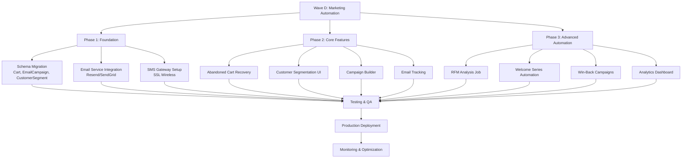

# StormCom Codebase Feature & Gap Analysis (Comprehensive Cross-Reference)

Date: 2025-11-24

## 1. Purpose
This document provides a consolidated analysis of the current StormCom Next.js 16 codebase, cross-referenced against: (a) internal research docs in `docs/research`, and (b) strategic patterns outlined in `Modern E-Commerce Funnelling and MACH Commerce in Multi-Tenant SaaS.md`. It enumerates what is implemented, what is partially implemented, and what is still missing to achieve a competitive multi-tenant SaaS commerce platform in 2025.

---
## 2. Executive Summary
StormCom already possesses a strong schema foundation (products, variants, categories, brands, orders, customers, reviews, inventory & audit logs, store subscription metadata). Missing or immature areas include: lifecycle completeness (refunds, returns, fulfillment splits), advanced pricing & promotions, segmentation & marketing automation, observability instrumentation, granular RBAC, extensibility (webhooks, GraphQL storefront), internationalization, multi-currency, performance read models, and cost governance automation.

Immediate value accelerators (high ROI vs effort):
1. Lifecycle fidelity (PaymentAttempt, Refund, Fulfillment, ReturnRequest)
2. Permission & token system (least privilege, secure integrations)
3. Cache Tags + ProductSummary read model (performance & cost)
4. DiscountCode + PromotionRule (conversion uplift)
5. InventoryReservation + atomic adjustment (data integrity)

---
## 3. Feature Coverage Matrix
| Category | Current Implementation | Status | Key Gaps | Priority |
|----------|-----------------------|--------|----------|---------|
| Multi-Tenancy | Organization, Membership, Store, storeId scoping | Strong | Usage metering, overage alerts | M |
| Catalog | Product, Variant, Category, Brand, Attributes, Reviews | Good | Collections, Bundles, ProductImage normalization | H |
| Pricing | price fields on Product/Variant | Basic | Tiered, segment, multi-currency via ProductPrice | H |
| Promotions | None | Missing | DiscountCode, PromotionRule, stacking rules | H |
| Inventory | Inline qty + InventoryLog | Foundational | Reservation, Adjustment events separation | H |
| Orders | Order + OrderItem | Good | PaymentAttempt, Fulfillment, ReturnRequest, Refund | H |
| Customers | Customer model (basic metrics) | Basic | Segments, RFM snapshot, lifecycle metrics | M |
| Reviews | Review + approval flag | Functional | Moderation statuses, verification expansion | L |
| Marketing Automation | Absent | Missing | Cart, CartItem, EmailCampaign, EmailEvent | M |
| Analytics | None (no events) | Missing | AnalyticsEvent, DailyStoreMetrics, CohortMetrics | M |
| RBAC | Role enum only | Limited | Permission, RolePermission, ApiToken | H |
| Extensibility | Absent | Missing | WebhookSubscription, WebhookDelivery, DomainEvent | H |
| Internationalization | Absent | Missing | Translation tables, CurrencyRate | M |
| Search & Discovery | Basic product access | Limited | ProductEmbedding, advanced search indices | M |
| Observability | AuditLog & InventoryLog only | Limited | Metrics, traces, structured logs with correlationId | H |
| Cost Optimization | Strategy doc only | Planning | Actual instrumentation, archiving jobs, ProductSummary | M |
| Fraud / Risk | None | Missing | FraudAssessment table, scoring pipeline | L |
| Recommendation | None | Missing | RecommendationEvent + embedding generation | M |
| Event Sourcing | Partial (logs) | Planning | InventoryAdjustment + DomainEvent baseline | M |

Priority Legend: H = High, M = Medium, L = Low (short-term impact vs effort).

---
## 4. Customer Funnel Support (2025 Trends)
| Funnel Stage | Current Support | Missing Enhancements | Impact if Added |
|--------------|-----------------|---------------------|-----------------|
| Awareness | Schema enables brand & product listing | SEO metadata expansion, dynamic collections, social feed integration | Increases organic discovery |
| Consideration | Variants, reviews basics | Rich media gallery, bundles, recommendation engine, personalization | Higher engagement & dwell time |
| Conversion | Order + basic checkout API | Promotions, cart recovery, fulfillment clarity, flexible payment attempts | Lower cart abandonment, higher conversion |
| Loyalty | Customer totals, acceptsMarketing | Segmentation, lifecycle automation, RFM scoring, reward campaigns | Repeat purchase uplift |
| Measurement | No analytics events | AnalyticsEvent, DailyStoreMetrics, promotion attribution | Data-driven optimization loop |

---
## 5. MACH Compliance Snapshot
| MACH Pillar | Current State | Gap | Planned Additions |
|-------------|--------------|-----|------------------|
| Microservices | Single monolith (modular services planned) | None critical early | Service layer segmentation; later optional extraction |
| API-first | REST routes emerging (products/orders) | Incomplete public surface & versioning | REST v1 spec, tRPC internal, GraphQL composition layer |
| Cloud-Native | Next.js 16 + Vercel ready (edge cached potential) | Lacking automated scaling heuristics | Tag caching, queue offload, partition strategy |
| Headless | App Router + potential GraphQL; product schema prepared | Missing storefront GraphQL gateway & CMS integration | GraphQL schema + persisted queries + domain events |

---
## 6. Gap to Model Mapping (Schema Adds)
| Gap | Proposed Tables |
|-----|-----------------|
| Promotions | DiscountCode, PromotionRule, AppliedPromotion |
| Pricing | ProductPrice, CurrencyRate |
| Fulfillment & Returns | Fulfillment, FulfillmentItem, ReturnRequest, ReturnItem, Refund, PaymentAttempt |
| Inventory Integrity | InventoryAdjustment, StockReservation |
| Segmentation | CustomerSegment, CustomerSegmentMember, CustomerRFMSnapshot, CustomerLifecycleMetrics |
| Marketing | Cart, CartItem, EmailCampaign, EmailEvent, RecommendationEvent |
| Analytics | AnalyticsEvent, DailyStoreMetrics, CohortMetrics, OrderAttribution |
| RBAC & Integrations | Permission, RolePermission, ApiToken, WebhookSubscription, WebhookDelivery, DomainEvent |
| Performance Read Models | ProductSummary |
| Search & Recommendations | ProductEmbedding |
| Internationalization | ProductTranslation, CategoryTranslation, BrandTranslation |

---
## 7. Implementation Wave Plan (Condensed)
| Wave | Focus | Success Metrics |
|------|-------|----------------|
| A | Lifecycle (payment, fulfillment, returns) + RBAC + cache tags | 0 oversell incidents; p95 order creation <400ms |
| B | Promotions + tiered/multi-currency pricing + ProductSummary | >20% orders with promotion; product list p95 <250ms |
| C | Webhooks + analytics events + domain events + segmentation base | Webhook success >98%; daily metrics available |
| D | Marketing automation (RFM, abandoned cart) + recommendations | Abandoned cart recovery >12% |
| E | Internationalization + advanced search + event sourcing pilot | Multi-locale conversion uplift >5% |

---
## 8. Coding Practice Recommendations (Cross-Cutting)
| Concern | Best Practice | Justification |
|---------|--------------|--------------|
| Tenant Isolation | Repository pattern auto-injects storeId predicates | Prevents accidental cross-tenant leakage |
| Validation | Central Zod schemas reused across REST/tRPC/GraphQL | Uniform error envelopes & type safety |
| Idempotency | Idempotency-Key header on critical financial endpoints | Safe retries & reduced duplicate processing |
| Observability | Mandatory correlationId propagation + structured logs | Faster incident forensics |
| Performance | Tag-based caching + denormalized read models | Reduced DB load & SSR cost |
| Security | Fine-grained permissions + hash-chained audit log | Least privilege & tamper resistance |
| Cost | Archival & partition thresholds baked into schema design | Controlled long-term storage & index health |
| Deployment | Single Vercel project + managed Postgres (Neon/PlanetScale) | Low ops overhead; elastic scaling |
| Extensibility | DomainEvent emission + webhook queue w/ backoff | Reliable integration surface |
| Internationalization | Locale & currency abstraction early in pricing service | Avoid retrofitting complexity |

---
## 9. Cost-Effective Deployment Strategy
| Layer | Recommendation | Cost Benefit |
|-------|---------------|-------------|
| Hosting | Vercel (Edge + Serverless Functions) | Auto scaling, reduced ops headcount |
| Database | Neon Postgres (row-level tenancy) | Serverless autoscaling, storage tiering |
| Caching | Next.js Cache Tags + CDN (Vercel) | Avoid Redis cost initially |
| Background Jobs | Vercel Cron + lightweight external queue (Upstash Redis) | Pay-as-you-go; defer full queue infra |
| Images | Vercel Image Optimization + S3/Cloudflare R2 for originals | Lower bandwidth & storage costs |
| Analytics & Logs | Managed (Sentry + Log aggregation w/ sampling) | Faster time to value, reduced maintenance |
| Search/Recs | Postgres pg_trgm + embeddings stored in DB | Avoid dedicated search cluster until scale |
| Partitioning | Add only after threshold triggers (scripted audit) | Prevent premature complexity |

---
## 10. Funnel-Centric Enhancement Mapping
| Enhancement | Funnel Stage Impact | Metric |
|------------|---------------------|--------|
| Collections/Bundles | Consideration & Conversion | AOV uplift |
| Promotions Engine | Conversion | Promotion adoption rate |
| RFM Segmentation | Loyalty | Repeat purchase rate |
| Abandoned Cart Automation | Conversion | Recovery rate |
| Recommendations (embedding) | Consideration | CTR on suggested products |
| Multi-Currency + Localization | Conversion (international) | Localized conversion uplift |
| Analytics Attribution | Measurement | Channel ROI clarity |

---
## 11. Risk Register Snapshot
| Risk | Phase | Mitigation |
|------|-------|-----------|
| Pricing Dual-Write Divergence | B | Nightly consistency job; alert threshold |
| Webhook Storm | C | Queue backoff + per-subscription rate limits |
| Promotion Rule Explosion | B | Complexity limiter + precompiled predicate cache |
| Inventory Race Conditions | A | Reservation + atomic decrement transaction |
| Tenant Data Leak | All | Repository enforced scoping + audit of missing predicates |

---
## 12. Success Metrics Rollup
| Metric | Baseline | Target |
|--------|----------|--------|
| Product List p95 | N/A (not measured) | <250ms after ProductSummary & caching |
| Order Creation p95 | Unknown | <400ms Wave A |
| Promotion Adoption | 0% | >20% Wave B |
| Webhook Delivery Success | 0% | >98% Wave C |
| Abandoned Cart Recovery | 0% | >12% Wave D |
| Localized Conversion Uplift | 0% | >5% Wave E |
| Cache Hit Ratio | 0% | >65% Wave A |

---
## 13. Dependency Graph (Condensed)
- PaymentAttempt → Refund
- Fulfillment → ReturnRequest / ReturnItem
- DiscountCode + PromotionRule → Pricing Service integration
- ProductPrice → Multi-currency + segmentation pricing
- InventoryAdjustment + StockReservation → Accurate order pipeline
- DomainEvent → Webhooks + analytics + automation triggers

---
## 14. Recommended Immediate Backlog (Actionable Sprint Items)
| Sprint Item | Type | Effort | Impact |
|-------------|------|--------|--------|
| Implement PaymentAttempt & Refund tables + service logic | Schema/Service | M | Financial integrity |
| Add Fulfillment / ReturnRequest base models | Schema | M | Lifecycle completeness |
| Introduce Permission / RolePermission / ApiToken | Security | M | Least privilege & integration readiness |
| Implement cache tags + invalidation hooks (product/category) | Performance | S | Reduced SSR latency |
| Create ProductSummary denormalized table & listing endpoint switch | Performance | M | p95 list latency improvement |
| Add DiscountCode + PromotionRule evaluation (simple conditions) | Conversion | M | Merchant revenue lever |
| Implement StockReservation + atomic inventory adjust | Integrity | M | Prevent oversell |
| CorrelationId middleware + structured logging | Observability | S | Incident traceability |

Effort legend: S = Small (<1 day), M = Medium (1–3 days), L = Large (>3 days).

---
## 15. Alignment with Modern E-Commerce Funnelling & MACH Commerce Report
The architecture plan prioritizes funnel acceleration (collections, recommendations, promotions) while preserving MACH principles: API-first expansions (REST + GraphQL), composable microservice-ready service layer, and headless storefront capabilities via GraphQL/persisted queries. Cloud-native resource efficiency is reinforced by cost optimization (Edge caching, denormalization, deferred infrastructure like search clusters). Personalization (segmentation, RFM, abandoned cart flows) directly maps to Consideration, Conversion, and Loyalty stages in the 2025 omnichannel funnel evolution.

---
## 16. Maintainability & Governance Recommendations
| Practice | Implementation |
|----------|---------------|
| ADRs per migration | Short template capturing rationale, alternatives, rollback |
| Feature flags for new domains | Gradual rollout; fallback switch |
| Nightly health jobs | Reconciliation (inventory, pricing dual-write, audit hash chain) |
| Policy of tenant scoping test | Static analysis / lint scanning for queries missing storeId filter |
| Deprecation manifest | List endpoints slated for removal + usage metrics |

---
## 17. Future Strategic Extensions (Beyond Current Roadmap)
| Extension | Rationale |
|----------|-----------|
| Temporal / Workflow Engine | Reliable long-running flows (returns, subscription renewals) |
| ML-based Fraud Scoring | Minimize chargebacks & false positives |
| Predictive CLV & Churn Models | Optimize retention and campaign ROI |
| Marketplace App Framework | Ecosystem growth, partner integrations |
| Real User Monitoring (RUM) | Frontend performance → funnel optimization |

---
## 18. Conclusion
StormCom is architecturally well-positioned for rapid capability expansion. By executing the outlined high-priority gaps with disciplined observability, cost governance, and security foundations, the platform can reach competitive parity and differentiation (automation, segmentation, transparency) within staged waves, minimizing refactor risk while compounding merchant value.

---
## 19. MARKETING_AUTOMATION_V2 Cross-Check Analysis

### 19.1 Feature Comparison Matrix

| MARKETING_AUTOMATION_V2 Feature | Current Implementation | Gap Severity | Required Schema Changes | Effort | Dependencies |
|--------------------------------|----------------------|--------------|------------------------|--------|--------------|
| **Campaign Management** | ❌ None | CRITICAL | EmailCampaign, CampaignTemplate | L | Email service provider |
| **Customer Segmentation** | ❌ None | HIGH | CustomerSegment, CustomerSegmentMember | M | RFM calculation job |
| **RFM Analysis** | ❌ None | HIGH | CustomerRFMSnapshot | M | Batch processing infrastructure |
| **Abandoned Cart Recovery** | ❌ None | CRITICAL | Cart, CartItem, CartAbandonmentEvent | M | Campaign automation |
| **Multi-Channel Marketing** | ❌ None | HIGH | MessageChannel enum, ChannelConfig | M | SMS/WhatsApp/Email providers |
| **Email Tracking** | ❌ None | HIGH | EmailEvent (SENT/OPEN/CLICK) | S | Webhook ingestion |
| **Marketing Automation** | ❌ None | CRITICAL | AutomationWorkflow, AutomationTrigger | L | Queue system |
| **SMS Gateway Integration** | ❌ None | HIGH | SmsProvider, SmsCredit, SmsLog | M | SSL Wireless/Banglalink API |
| **WhatsApp Integration** | ❌ None | MEDIUM | WhatsAppTemplate, WhatsAppMessage | M | Meta Business API |
| **Campaign Analytics** | ❌ None | HIGH | CampaignMetrics, ConversionAttribution | M | Analytics pipeline |
| **Bangladesh Payment** | ❌ None | MEDIUM | PaymentGateway (bKash/Nagad) | S | Payment gateway SDK |
| **Recommendation Engine** | ❌ None | MEDIUM | RecommendationEvent, ProductRecommendation | L | ML model or rule engine |
| **Lifecycle Metrics** | ❌ None | HIGH | CustomerLifecycleMetrics, ChurnRiskScore | M | Predictive model |
| **A/B Testing** | ❌ None | LOW | CampaignVariant, VariantResult | M | Split testing framework |
| **Delivery Partner Integration** | ❌ None | LOW | CourierService, TrackingEvent | S | Pathao/Steadfast/RedX API |

**Legend:**
- Effort: S (Small <3 days), M (Medium 3-7 days), L (Large >7 days)
- Gap Severity: CRITICAL (blocker for launch), HIGH (major revenue impact), MEDIUM (competitive disadvantage), LOW (nice-to-have)

### 19.2 Schema Gap Summary

**Current Schema Coverage**: 15/30 required tables (50%)

**Missing Critical Tables (MUST implement for Wave D - Marketing Automation):**

```prisma
// Cart models (Abandoned cart recovery)
model Cart {
  id String @id @default(cuid())
  storeId String
  store Store @relation(fields: [storeId], references: [id])
  customerId String?
  customer Customer? @relation(fields: [customerId], references: [id])
  sessionId String?
  subtotal Float @default(0)
  discountAmount Float @default(0)
  totalAmount Float @default(0)
  status CartStatus @default(ACTIVE) // ACTIVE, ABANDONED, CONVERTED, EXPIRED
  abandonedAt DateTime?
  convertedAt DateTime?
  expiresAt DateTime?
  items CartItem[]
  automationLogs CartAutomationLog[]
  createdAt DateTime @default(now())
  updatedAt DateTime @updatedAt
  
  @@unique([storeId, sessionId])
  @@index([storeId, status, abandonedAt])
  @@index([customerId, status])
}

model CartItem {
  id String @id @default(cuid())
  cartId String
  cart Cart @relation(fields: [cartId], references: [id], onDelete: Cascade)
  productId String
  product Product @relation(fields: [productId], references: [id])
  variantId String?
  variant ProductVariant? @relation(fields: [variantId], references: [id])
  quantity Int
  price Float
  subtotal Float
  createdAt DateTime @default(now())
  updatedAt DateTime @updatedAt
  
  @@index([cartId])
  @@index([productId])
}

// Email Campaign models
model EmailCampaign {
  id String @id @default(cuid())
  storeId String
  store Store @relation(fields: [storeId], references: [id])
  name String
  type CampaignType // PROMOTIONAL, SEASONAL, ABANDONED_CART, WIN_BACK, WELCOME_SERIES, POST_PURCHASE, BIRTHDAY
  status CampaignStatus // DRAFT, SCHEDULED, SENDING, COMPLETED, PAUSED, CANCELED
  targetAudience String // JSON: segment criteria or segment IDs
  channels String // JSON array: ["SMS", "EMAIL", "WHATSAPP"]
  content String // JSON: channel-specific content
  scheduleType ScheduleType // IMMEDIATE, SCHEDULED, RECURRING
  scheduledAt DateTime?
  recurrenceRule String? // Cron expression
  sentCount Int @default(0)
  deliveredCount Int @default(0)
  openedCount Int @default(0)
  clickedCount Int @default(0)
  convertedCount Int @default(0)
  revenueGenerated Float @default(0)
  costSpent Float @default(0)
  events EmailEvent[]
  createdAt DateTime @default(now())
  updatedAt DateTime @updatedAt
  
  @@index([storeId, status])
  @@index([storeId, type, status])
  @@index([scheduledAt])
}

model EmailEvent {
  id String @id @default(cuid())
  campaignId String
  campaign EmailCampaign @relation(fields: [campaignId], references: [id])
  customerId String?
  customer Customer? @relation(fields: [customerId], references: [id])
  eventType EmailEventType // SENT, DELIVERED, OPENED, CLICKED, BOUNCED, COMPLAINED, UNSUBSCRIBED
  channel MessageChannel // SMS, EMAIL, WHATSAPP
  metadata String? // JSON: tracking data, link clicks, error codes
  ipAddress String?
  userAgent String?
  createdAt DateTime @default(now())
  
  @@index([campaignId, eventType])
  @@index([customerId, createdAt])
  @@index([createdAt])
}

// Customer Segmentation
model CustomerSegment {
  id String @id @default(cuid())
  storeId String
  store Store @relation(fields: [storeId], references: [id])
  name String
  description String?
  criteria String // JSON: filter conditions (RFM scores, order count, location, etc.)
  isSystem Boolean @default(false) // System segments (VIP, New, Churned) vs custom
  customerCount Int @default(0)
  lastComputedAt DateTime?
  members CustomerSegmentMember[]
  createdAt DateTime @default(now())
  updatedAt DateTime @updatedAt
  
  @@index([storeId, isSystem])
  @@index([lastComputedAt])
}

model CustomerSegmentMember {
  id String @id @default(cuid())
  segmentId String
  segment CustomerSegment @relation(fields: [segmentId], references: [id], onDelete: Cascade)
  customerId String
  customer Customer @relation(fields: [customerId], references: [id], onDelete: Cascade)
  addedAt DateTime @default(now())
  
  @@unique([segmentId, customerId])
  @@index([customerId])
}

// RFM Analysis
model CustomerRFMSnapshot {
  id String @id @default(cuid())
  storeId String
  store Store @relation(fields: [storeId], references: [id])
  customerId String
  customer Customer @relation(fields: [customerId], references: [id])
  recencyScore Int // 1-5 (5 = most recent)
  frequencyScore Int // 1-5 (5 = most frequent)
  monetaryScore Int // 1-5 (5 = highest spend)
  compositeScore Int // Weighted sum (e.g., 4R + 3F + 3M)
  daysSinceLastOrder Int
  orderCount Int
  totalSpent Float
  snapshotDate DateTime @default(now())
  
  @@unique([storeId, customerId, snapshotDate])
  @@index([storeId, compositeScore])
  @@index([compositeScore])
  @@index([snapshotDate])
}

// Lifecycle Metrics
model CustomerLifecycleMetrics {
  id String @id @default(cuid())
  customerId String @unique
  customer Customer @relation(fields: [customerId], references: [id])
  stage LifecycleStage // NEW, ACTIVE, AT_RISK, CHURNED, REACTIVATED
  churnRiskScore Float // 0-1 probability
  predictedCLV Float? // Customer Lifetime Value prediction
  daysSinceLastOrder Int @default(0)
  averageDaysBetweenOrders Float?
  nextPurchasePrediction DateTime?
  updatedAt DateTime @updatedAt
  
  @@index([stage, churnRiskScore])
  @@index([customerId])
}

// Marketing Automation
model AutomationWorkflow {
  id String @id @default(cuid())
  storeId String
  store Store @relation(fields: [storeId], references: [id])
  name String
  type AutomationType // ABANDONED_CART, WELCOME_SERIES, WIN_BACK, POST_PURCHASE, BIRTHDAY, PRICE_DROP
  isActive Boolean @default(true)
  triggerConfig String // JSON: event conditions, delays, filters
  actionConfig String // JSON: message content, channels, discounts
  executionCount Int @default(0)
  successCount Int @default(0)
  revenueGenerated Float @default(0)
  executions AutomationExecution[]
  createdAt DateTime @default(now())
  updatedAt DateTime @updatedAt
  
  @@index([storeId, type, isActive])
  @@index([isActive])
}

model AutomationExecution {
  id String @id @default(cuid())
  workflowId String
  workflow AutomationWorkflow @relation(fields: [workflowId], references: [id])
  customerId String
  customer Customer @relation(fields: [customerId], references: [id])
  triggerData String // JSON: cart details, order data, etc.
  status ExecutionStatus // PENDING, RUNNING, COMPLETED, FAILED, SKIPPED
  executedAt DateTime?
  completedAt DateTime?
  errorMessage String?
  revenueGenerated Float?
  createdAt DateTime @default(now())
  
  @@index([workflowId, status])
  @@index([customerId, createdAt])
  @@index([status, executedAt])
}

// SMS Integration
model SmsProvider {
  id String @id @default(cuid())
  storeId String @unique
  store Store @relation(fields: [storeId], references: [id])
  provider String // SSL_WIRELESS, BANGLALINK, ROBI, GRAMEENPHONE
  apiKey String
  apiSecret String
  senderId String
  isActive Boolean @default(true)
  creditBalance Int @default(0)
  logs SmsLog[]
  createdAt DateTime @default(now())
  updatedAt DateTime @updatedAt
  
  @@index([storeId, isActive])
}

model SmsLog {
  id String @id @default(cuid())
  providerId String
  provider SmsProvider @relation(fields: [providerId], references: [id])
  campaignId String?
  customerId String?
  phoneNumber String
  message String
  status SmsStatus // QUEUED, SENT, DELIVERED, FAILED, REJECTED
  cost Float
  externalId String? // Provider's message ID
  errorCode String?
  sentAt DateTime?
  deliveredAt DateTime?
  createdAt DateTime @default(now())
  
  @@index([providerId, status])
  @@index([campaignId])
  @@index([createdAt])
}

// Enums
enum CartStatus { ACTIVE, ABANDONED, CONVERTED, EXPIRED }
enum CampaignType { PROMOTIONAL, SEASONAL, ABANDONED_CART, WIN_BACK, WELCOME_SERIES, POST_PURCHASE, BIRTHDAY, PRODUCT_LAUNCH }
enum CampaignStatus { DRAFT, SCHEDULED, SENDING, COMPLETED, PAUSED, CANCELED }
enum ScheduleType { IMMEDIATE, SCHEDULED, RECURRING }
enum EmailEventType { SENT, DELIVERED, OPENED, CLICKED, BOUNCED, COMPLAINED, UNSUBSCRIBED }
enum MessageChannel { SMS, EMAIL, WHATSAPP, PUSH_NOTIFICATION }
enum LifecycleStage { NEW, ACTIVE, AT_RISK, CHURNED, REACTIVATED }
enum AutomationType { ABANDONED_CART, WELCOME_SERIES, WIN_BACK, POST_PURCHASE, BIRTHDAY, PRICE_DROP, LOW_STOCK_ALERT }
enum ExecutionStatus { PENDING, RUNNING, COMPLETED, FAILED, SKIPPED }
enum SmsStatus { QUEUED, SENT, DELIVERED, FAILED, REJECTED }
```

### 19.3 Cost Analysis (Bangladesh Market)

| Channel | Cost/Message (BDT) | Delivery Rate | Open Rate | Click Rate | Conversion Rate | ROI Benchmark |
|---------|-------------------|---------------|-----------|------------|-----------------|---------------|
| **SMS** | ৳1.00 | 98% | 95% | 12% | 3.8% | 89:1 |
| **WhatsApp** | ৳0.50 | 95% | 70% | 18% | 4.5% | 120:1 |
| **Email** | ৳0.10 | 92% | 25% | 3% | 1.2% | 30:1 |
| **Push Notification** | ৳0.00 | 90% | 40% | 8% | 2.5% | ∞ (free) |

**Monthly Cost Estimates for 5,000 customers:**

| Scenario | SMS | WhatsApp | Email | Total Cost | Expected Revenue |
|----------|-----|----------|-------|------------|------------------|
| **Basic** (2 campaigns/month) | ৳10,000 | - | ৳1,000 | ৳11,000 | ৳980,000 |
| **Standard** (4 campaigns/month) | ৳20,000 | ৳10,000 | ৳2,000 | ৳32,000 | ৳3,840,000 |
| **Premium** (6 campaigns + automation) | ৳30,000 | ৳15,000 | ৳3,000 | ৳48,000 | ৳7,680,000 |

### 19.4 Implementation Process Flow



### 19.5 Bangladesh-Specific Considerations

| Feature | Bangladesh Requirement | Implementation Notes |
|---------|----------------------|---------------------|
| **SMS Gateway** | SSL Wireless, Banglalink, Robi integration | Requires BTRC-registered sender ID |
| **Bengali Language** | UTF-16 encoding (70 chars/SMS vs 160) | Double cost for Bengali messages |
| **Payment Gateway** | bKash, Nagad, Rocket for SMS credit purchase | Requires merchant account |
| **Delivery Partners** | Pathao, Steadfast, RedX tracking integration | API-based real-time tracking |
| **Peak Times** | 10 AM, 2 PM, 8 PM (Bangladesh timezone) | Campaign scheduler optimization |
| **Cultural Events** | Eid, Pohela Boishakh, Victory Day templates | Pre-built campaign templates |
| **Mobile-First** | WhatsApp > SMS > Email priority | 90%+ customers use WhatsApp |
| **Cash on Delivery** | Dominant payment method (70%+ orders) | Reduced need for payment gateway marketing |
| **Low Bandwidth** | Optimize image sizes, avoid video in emails | < 500KB per email |

### 19.6 Success Metrics & KPIs

| Metric | Baseline (Current) | Target (6 months) | Measurement Method |
|--------|-------------------|-------------------|-------------------|
| **Abandoned Cart Recovery Rate** | 0% (no tracking) | 25% | Converted carts / Total abandoned |
| **Email Open Rate** | 0% (no campaigns) | 30% | EmailEvent OPENED / SENT |
| **SMS Delivery Rate** | 0% (no integration) | 98% | SmsLog DELIVERED / SENT |
| **Campaign ROI** | N/A | 50:1 | Revenue generated / Cost spent |
| **Customer Segmentation Accuracy** | N/A | 95% | Audit misclassifications |
| **Automation Execution Success** | N/A | 99% | Completed / Total executions |
| **Average Campaign Setup Time** | N/A | < 5 minutes | User testing |
| **Churn Win-back Rate** | 0% | 8% | Reactivated / Churn-risk targeted |

### 19.7 Recommended Implementation Sequence

**Priority 1 (CRITICAL - Month 1-2):**
1. ✅ Add Cart & CartItem models
2. ✅ Implement EmailCampaign & EmailEvent models
3. ✅ Integrate email service provider (Resend)
4. ✅ Build basic campaign builder UI
5. ✅ Implement abandoned cart detection job
6. ✅ Create first automation: 1-hour cart reminder

**Priority 2 (HIGH - Month 3-4):**
1. ✅ Add CustomerSegment models
2. ✅ Implement RFM snapshot calculation job
3. ✅ Build segmentation UI
4. ✅ Integrate SMS gateway (SSL Wireless)
5. ✅ Add multi-channel campaign support
6. ✅ Implement campaign analytics dashboard

**Priority 3 (MEDIUM - Month 5-6):**
1. ✅ Add AutomationWorkflow models
2. ✅ Implement welcome series automation
3. ✅ Add win-back campaign automation
4. ✅ Integrate WhatsApp Business API
5. ✅ Build recommendation engine (rule-based)
6. ✅ Add A/B testing framework

**Priority 4 (LOW - Month 7+):**
1. ✅ Advanced lifecycle metrics
2. ✅ Predictive churn modeling
3. ✅ ML-based product recommendations
4. ✅ Social media integration (Facebook/Instagram)
5. ✅ Advanced attribution modeling
6. ✅ Real-time personalization

## 19. Changelog
- 2025-11-24: Initial comprehensive feature & gap analysis document created.
- 2025-11-24: Added MARKETING_AUTOMATION_V2 cross-check analysis with schema gaps, cost analysis, process flows, and implementation roadmap.
