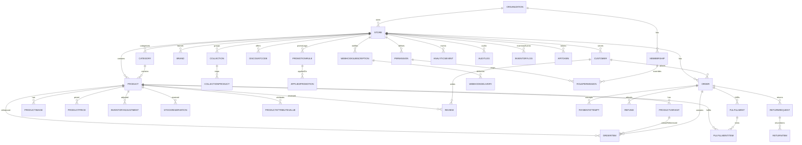

# StormCom Database Schema Analysis & Evolution Plan

## Current Strengths
- Comprehensive core commerce entities (Product, Variant, Category, Brand, Order, Customer).
- Audit and Inventory logs present early.
- Store-level subscription meta enabling platform monetization.
- Use of enums for key lifecycle states (ProductStatus, OrderStatus, PaymentStatus, SubscriptionStatus).

## Current Weaknesses / Gaps
| Area | Issue | Consequence |
|------|-------|-------------|
| Pricing | Single price fields; no multi-currency or tier | Limits internationalization & B2B volume pricing |
| Promotions | Absent discount/promotion modeling | No dynamic marketing levers |
| Fulfillment | No partial shipments or fulfillment entity | Can't track multi-package deliveries |
| Returns & Refunds | No structured return/refund tables | Manual reconciliation risk |
| Inventory | Product stock holds canonical qty + event logs conflated; no reservations | Oversell risk & difficult concurrency safety |
| Search | Images stored as JSON; no product images table; no embeddings | Hard to optimize queries & recommendations |
| RBAC | Enum-only roles; no permission granularity | Overbroad access / limited governance |
| Extensibility | No webhooks, plugin/app tables | Integrations blocked |
| Internationalization | No translation or currency rate tables | Single locale & currency constraint |
| Analytics | Missing events & aggregation tables | Hinders data-driven product iteration |

## Proposed Additions (New Tables)
| Table | Purpose |
|-------|---------|
| Collection / CollectionProduct | Curated product groupings & merchandising |
| ProductBundle / BundleItem | Bundled offers with aggregated inventory & pricing |
| ProductImage | Normalized images (ordering, alt text, SEO) |
| ProductPrice | Multi-currency; tier, segment-based pricing |
| ProductTranslation / CategoryTranslation / BrandTranslation | Locale-specific content |
| DiscountCode | Promotional codes with constraints |
| PromotionRule / AppliedPromotion | Complex conditional promotions |
| PaymentProviderConfig | Gateway credential abstraction |
| PaymentAttempt | Track retries & external references |
| Refund | Monetary adjustments post-payment |
| ReturnRequest / ReturnItem | RMA management |
| Fulfillment / FulfillmentItem | Shipment partition & tracking |
| ShippingProfile / ShippingRate | Configurable shipping logic |
| Shipment | Carrier label & tracking lifecycle |
| InventoryAdjustment | Event sourcing separation from Product stock snapshot |
| StockReservation | Temporary holds during checkout |
| CustomerSegment / CustomerSegmentMember | Targeted marketing |
| CustomerCustomField / CustomerCustomValue | Extended CRM data |
| AnalyticsEvent | Raw event ingestion |
| DailyStoreMetrics / CohortMetrics | Precomputed aggregate performance |
| OrderAttribution | Marketing channel attribution |
| Permission / RolePermission / ApiToken | Fine-grained RBAC + integration |
| WebhookSubscription / WebhookDelivery | Extensibility & external reactions |
| AppIntegration | Plugin marketplace foundation |
| JobDescriptor | Background job tracking |
| ProductEmbedding | Vector search & recommendations |
| DomainEvent | Immutable domain state transitions |
| CurrencyRate | FX conversions |
| Subscription (future separate from Store plan) | Recurring product/service billing |
| FraudAssessment | Fraud scoring metadata |

## Modeling Patterns
1. Event Sourcing (Incremental Adoption): Use `InventoryAdjustment` and (later) `DomainEvent` for high-value transitions (order status change, refund issued). Keep current state in aggregate tables (e.g., Product inventory fields) for read efficiency.
2. Soft Delete Uniformity: Ensure all soft-deletable tables share `deletedAt` and index partial queries: `CREATE INDEX ON products (store_id, status) WHERE deleted_at IS NULL`.
3. Correlation IDs: Add `correlationId` (UUID) and `requestId` to `AuditLog`, `PaymentAttempt`, `Fulfillment`, `Refund` for trace stitching.
4. JSON Normalization: Replace `images JSON` with normalized `ProductImage` for easier alt text additions and CDN transformations.
5. Multi-Currency & Segmented Pricing: `ProductPrice` keyed by `(productId|variantId, currency, segmentId?, minQty?)`.
6. Promotion Rule Engine: Condition JSON (e.g., `{ "minSubtotal": 100, "customerSegmentId": "..." }`) + Action JSON (`{ "discountPercent": 10 }`). Evaluate via deterministic interpreter service.
7. Index Strategy: Composite indexes including tenant key `storeId` first; partial indexes to reduce size and increase selectivity.

## Representative Prisma Model Drafts
```prisma
model ProductImage {
  id        String @id @default(cuid())
  productId String
  product   Product @relation(fields: [productId], references: [id], onDelete: Cascade)
  url       String
  alt       String?
  position  Int @default(0)
  createdAt DateTime @default(now())
  @@index([productId, position])
}

model ProductPrice {
  id          String @id @default(cuid())
  productId   String?
  variantId   String?
  currency    String @default("USD")
  segmentId   String? // customer segmentation
  minQty      Int @default(1)
  amount      Float
  compareAt   Float?
  effectiveAt DateTime @default(now())
  expiresAt   DateTime?
  createdAt   DateTime @default(now())
  @@index([productId, currency, segmentId])
  @@index([variantId, currency, segmentId])
}

model PaymentAttempt {
  id          String @id @default(cuid())
  orderId     String
  order       Order @relation(fields: [orderId], references: [id], onDelete: Cascade)
  gateway     PaymentGateway
  status      PaymentStatus @default(PENDING)
  amount      Float
  externalRef String? // Stripe payment intent id
  failureReason String?
  correlationId String? // request flow
  createdAt   DateTime @default(now())
  updatedAt   DateTime @updatedAt
  @@index([orderId, status])
}

model Refund {
  id        String @id @default(cuid())
  orderId   String
  order     Order @relation(fields: [orderId], references: [id], onDelete: Cascade)
  paymentAttemptId String?
  paymentAttempt   PaymentAttempt? @relation(fields: [paymentAttemptId], references: [id])
  amount    Float
  status    String @default("pending") // pending|processed|failed
  reason    String?
  createdAt DateTime @default(now())
  processedAt DateTime?
  @@index([orderId])
}

model Fulfillment {
  id        String @id @default(cuid())
  orderId   String
  order     Order @relation(fields: [orderId], references: [id], onDelete: Cascade)
  status    String @default("pending") // pending|packed|shipped|delivered|canceled
  trackingNumber String?
  carrier   String?
  trackingUrl String?
  shippedAt DateTime?
  deliveredAt DateTime?
  createdAt DateTime @default(now())
  updatedAt DateTime @updatedAt
  items     FulfillmentItem[]
  @@index([orderId, status])
}

model FulfillmentItem {
  id             String @id @default(cuid())
  fulfillmentId  String
  fulfillment    Fulfillment @relation(fields: [fulfillmentId], references: [id], onDelete: Cascade)
  orderItemId    String
  orderItem      OrderItem @relation(fields: [orderItemId], references: [id], onDelete: Cascade)
  quantity       Int
  @@unique([fulfillmentId, orderItemId])
}

model ReturnRequest {
  id        String @id @default(cuid())
  orderId   String
  order     Order @relation(fields: [orderId], references: [id], onDelete: Cascade)
  status    String @default("requested") // requested|approved|received|refunded|rejected
  reasonCode String?
  initiatedByCustomer Boolean @default(true)
  createdAt DateTime @default(now())
  updatedAt DateTime @updatedAt
  items     ReturnItem[]
  @@index([orderId, status])
}

model ReturnItem {
  id              String @id @default(cuid())
  returnRequestId String
  returnRequest   ReturnRequest @relation(fields: [returnRequestId], references: [id], onDelete: Cascade)
  orderItemId     String
  orderItem       OrderItem @relation(fields: [orderItemId], references: [id], onDelete: Cascade)
  quantity        Int
  condition       String @default("new") // new|opened|damaged
  @@unique([returnRequestId, orderItemId])
}

model InventoryAdjustment {
  id          String @id @default(cuid())
  storeId     String
  productId   String?
  variantId   String?
  delta       Int
  reasonCode  String // sale|return|manual|correction|initial
  note        String?
  correlationId String?
  userId      String?
  createdAt   DateTime @default(now())
  @@index([storeId, productId])
  @@index([storeId, variantId])
}

model StockReservation {
  id          String @id @default(cuid())
  storeId     String
  productId   String?
  variantId   String?
  quantity    Int
  expiresAt   DateTime
  orderId     String?
  createdAt   DateTime @default(now())
  @@index([storeId, productId])
  @@index([storeId, variantId])
  @@index([expiresAt])
}
```

## Index & Performance Strategy
- Always prefix composite indexes with `storeId` for tenant isolation & selectivity.
- Partial indexes excluding soft-deleted rows: `CREATE INDEX active_products_idx ON products (store_id, status) WHERE deleted_at IS NULL;`
- Covering indexes when pagination heavy: `(store_id, created_at DESC, id)` for orders.
- Consider table partitioning (Postgres) by month for `AuditLog` and `AnalyticsEvent` after exceeding ~50M rows.

## Mermaid ER Diagram (Core + Proposed Extensions)


## Migration Sequencing Strategy
1. Non-invasive tables (Collections, ProductImage, PaymentAttempt, Refund, Fulfillment, ReturnRequest) – additive.
2. Pricing restructure (`ProductPrice`) while retaining legacy price fields; dual-write then remove old fields.
3. Inventory event separation (introduce `InventoryAdjustment`) – backfill from existing `inventoryQty` delta calculations.
4. Promotion system (DiscountCode, PromotionRule, AppliedPromotion) – integrate into order pricing pipeline.
5. RBAC expansion – create permissions, map existing roles to permission sets.
6. Webhook & analytics events – start capturing without consumers, validate volume & reliability.
7. Internationalization tables – optional feature flags per store.

## Data Integrity & Constraints
- Enforce uniqueness constraints for slugs per tenant across new tables.
- Use cascading deletes carefully; prefer soft delete for merchant-managed content (products, collections) and hard delete for ephemeral logs (reservations after expiry).
- Guarantee `Refund.amount <= PaymentAttempt.amount` at application service layer.

## Observability & Auditing Enhancements
Add fields to `AuditLog`:
```prisma
model AuditLog {
  // existing fields...
  correlationId String?
  requestId String?
  actorType String @default("USER") // USER|SYSTEM|JOB
  severity  String @default("info") // info|warning|critical
  signature String? // HMAC for tamper detection
}
```
Signature workflow: `signature = HMAC(store.auditSecret, concat(entityType, entityId, action, createdAt))`.

## Risk Mitigation
| Risk | Mitigation |
|------|------------|
| Overselling | StockReservation + atomic decrement in transaction |
| Inconsistent pricing | ProductPrice dual-write transitional period |
| Promotions stacking errors | Deterministic evaluation order & isStackable flags |
| Migration rollback complexity | Feature flag gating of new tables; keep legacy flows until validated |
| Performance regression | Add indexes alongside migrations; run EXPLAIN benchmarks |

## Implementation KPIs
- Payment success/failure tracked by PaymentAttempt ratio.
- Inventory accuracy tracked by delta reconciliation between aggregate and adjustment events.
- Promotion redemption count vs usageLimit.
- Webhook delivery success rate & latency distribution.
- Query performance for product listing after introducing collections (95th percentile ≤ previous baseline).

## Conclusion
This evolution introduces modularity, scalability, and analytics readiness while preserving existing operational behaviors. A disciplined, phased migration (additive → dual-write → cutover) minimizes risk and ensures backward compatibility. Event and pricing models position StormCom for future international, multi-channel, and AI-driven recommendation features.

---

# Extended Addendum: Advanced Modeling, Partitioning, Integrity & Read Optimization

## A. Denormalized Read Models & Caching Synergy
Introduce a `ProductSummary` table to accelerate list & search views:
```prisma
model ProductSummary {
  productId   String @id
  storeId     String
  name        String
  slug        String
  price       Float
  featured    Boolean @default(false)
  inventoryStatus InventoryStatus
  categorySlug String?
  brandSlug    String?
  updatedAt   DateTime @updatedAt
  cachedAt    DateTime @default(now())
  @@index([storeId, featured])
  @@index([storeId, inventoryStatus])
}
```
Populate via background job or trigger on product mutation; pair with Cache Tags (`product:{id}`, `category:{categoryId}`) to reduce origin recomputation.

## B. Reservation vs Adjustment Separation
`StockReservation` provides *potential* demand; `InventoryAdjustment` records *actual* stock changes. To prevent oversell:
1. Reserve → Payment success → Apply adjustment (delta negative) → Release reservation.
2. Expired reservation cleanup job frees stale holds.
3. Reconciliation formula: `CurrentQty == InitialQty + Σ(Adjustments.delta) - Σ(ActiveReservations.qty)` (must hold invariant).

## C. Hash-Chained Audit Log Pattern
Extend `AuditLog` with `prevHash` forming a chain:
```prisma
model AuditLog {
  id         String @id @default(cuid())
  storeId    String?
  action     String
  entityType String
  entityId   String
  changes    String?
  correlationId String?
  requestId  String?
  actorType  String @default("USER")
  severity   String @default("info")
  prevHash   String?
  hash       String
  createdAt  DateTime @default(now())
  @@index([storeId, createdAt])
}
```
`hash = HMAC(secret, concat(id, prevHash, entityType, entityId, action, createdAt))`; tamper evident if chain breaks.

## D. Promotion Rule Indexing & Performance
Add targeted indexes for rule evaluation:
```sql
CREATE INDEX promotion_active_idx ON promotion_rules (store_id) WHERE is_active = true;
CREATE INDEX promotion_validity_idx ON promotion_rules (store_id, starts_at, ends_at);
```
Evaluation pipeline: load active + validity-window filtered rules → pre-filter by simple criteria (subtotal range) → interpret complex JSON conditions (segment membership, product inclusion). Cache compiled predicates for hot rules.

## E. Partitioning Strategy Thresholds (Postgres)
| Table | Partition Key | Threshold | Action |
|-------|---------------|-----------|--------|
| audit_logs | month(created_at) | > 30M rows total | Create monthly partitions |
| inventory_adjustments | month(created_at) | > 10M rows | Partition for pruning |
| analytics_events | day(created_at) (rolling window) | > 100M rows | Daily partitions + roll-up |

Use native partitioning or `pg_partman`; maintain parent indexes only where necessary.

## F. Multi-Currency Precision
Switch monetary fields to `Decimal` type to avoid floating point rounding:
```prisma
model ProductPrice {
  amount    Decimal @db.Decimal(10,2)
  compareAt Decimal? @db.Decimal(10,2)
  // ... other fields
}
```
Currency conversion: store FX rates in `CurrencyRate (base, quote, rate Decimal(12,6), fetchedAt)`; apply midday refresh schedule; avoid cascading conversions (always from canonical base currency e.g., USD).

## G. Segmentation & RFM Snapshot Modeling
RFM snapshot:
```prisma
model CustomerRFMSnapshot {
  id          String @id @default(cuid())
  customerId  String
  storeId     String
  recencyScore    Int
  frequencyScore  Int
  monetaryScore   Int
  compositeScore  Int
  calculatedAt    DateTime @default(now())
  @@index([storeId, compositeScore])
}
```
Composite scoring: Weighted formula (e.g., 4*recency + 3*frequency + 3*monetary). Store snapshots to track movement; last snapshot drives segment membership.

## H. DomainEvent Generalization
```prisma
model DomainEvent {
  id           String @id @default(cuid())
  storeId      String
  eventType    String // e.g. ORDER_CREATED
  entityType   String // Order, Product
  entityId     String
  payload      String // JSON
  correlationId String?
  createdAt    DateTime @default(now())
  @@index([storeId, eventType, createdAt])
}
```
Use for webhook generation, analytics ingestion, automation triggers (abandoned cart, RFM recalculation).

## I. Automated Consistency Checks
Nightly job performing:
1. Inventory reconciliation variance threshold (< 0.5% of SKUs) else alert.
2. Promotion usage vs limit anomalies.
3. Hash-chain audit integrity verification.
4. Partition size & index bloat report (unused index ratio).

## J. Migration Rollback Strategy
Maintain migration ADR with: intent, forward plan, rollback plan (drop new tables only if no downstream references; maintain data copy in separate schema for safe revert). Use feature flags to decouple schema presence from active code paths.

## K. Read vs Write Workload Isolation (Future)
Prepare connection tags: primary for writes, read replica for heavy analytics (Prisma supports separate datasources future). Mark queries eligible for replica (e.g., product list, metrics fetch) in repository.

## L. Data Privacy & Encryption Hooks
Introduce Prisma middleware for encryption:
```ts
prisma.$use(async (params, next) => {
  if (params.model === 'Customer' && params.action === 'create') {
    params.args.data.emailEncrypted = encrypt(params.args.data.email)
    delete params.args.data.email
  }
  return next(params)
})
```
Keep raw email only in transient memory for verification flows.

---
*Extended addendum appended to support advanced planning & resilience. Cross-reference implementation roadmap for phase alignment.*

---
## 2025-11-24 Cross-Reference & Schema Governance Addendum
This addendum maps proposed schema evolution to the funnel and MACH strategy while introducing governance & cost-aware partition policies.

### A. Funnel Mapping of New Tables
| Table Group | Funnel Stage Benefit | Metric |
|-------------|----------------------|--------|
| DiscountCode / PromotionRule / AppliedPromotion | Conversion | Promotion adoption %, discount ROI |
| Collection / ProductBundle | Consideration / Conversion | Collection GMV share |
| CustomerSegment / RFMSnapshot / LifecycleMetrics | Loyalty | Repeat purchase uplift, churn reduction |
| Cart / CartItem | Conversion | Abandoned cart recovery |
| RecommendationEvent / ProductEmbedding | Consideration | Recommendation CTR |
| AnalyticsEvent / DailyStoreMetrics | Measurement | Data freshness SLA |
| Fulfillment / ReturnRequest / Refund / PaymentAttempt | Conversion / Loyalty (trust) | Fulfillment latency, refund turnaround |

### B. MACH Pillar Alignment
| Pillar | Schema Strategy |
|--------|----------------|
| Microservices ready | Domain boundaries explicit (order, inventory, pricing) enabling future extraction |
| API-first | Tables normalized for predictable REST/GraphQL representations |
| Cloud-native | Partition keys & denormalized read models reduce hot-path resource usage |
| Headless | Rich product relationships (images, bundles, collections) facilitate composable storefront queries |

### C. Governance & ADR Requirements
| Change Type | Required Artifact |
|------------|------------------|
| New table introduction | ADR with rationale, rollback plan |
| Partition activation | Threshold report + capacity projection |
| Column removal (legacy) | Dual-write verification log (14 days) |
| Index addition | EXPLAIN baseline diff + utilization forecast |

### D. Integrity & Observability Enhancements
| Integrity Aspect | Implementation |
|------------------|---------------|
| Pricing dual-write | Consistency job + mismatch alert |
| Inventory reconciliations | Nightly invariant check (qty vs adjustments - reservations) |
| Audit hash chain | Verification script & tamper alert |
| Promotion stacking | Deterministic evaluation + conflict logging |

### E. Cost & Partition Strategy Extensions
| Table | Early Warning Metric | Pre-Partition Action |
|-------|---------------------|---------------------|
| audit_logs | Growth rate > 15% MoM | Evaluate compression & indexing efficiency |
| inventory_adjustments | Write latency p95 > target | Add covering index before partition |
| analytics_events | Daily volume spike > 30% | Increase sampling / roll-up frequency |

### F. Immediate Migration Bundle (Refined)
| Bundle | Tables | Notes |
|--------|--------|-------|
| Lifecycle | PaymentAttempt, Refund, Fulfillment, FulfillmentItem, ReturnRequest, ReturnItem | Adds full post-order workflow |
| Merchandising | Collection, CollectionProduct, ProductImage | Discovery & SEO improvements |
| Promotions | DiscountCode, PromotionRule, AppliedPromotion | Conversion lever |
| Pricing | ProductPrice, CurrencyRate | Enables multi-currency & tiered logic |
| Integrity | InventoryAdjustment, StockReservation | Prevent oversell; auditing inventory correctness |

### G. Success Metrics Extension
| Metric | Target |
|--------|-------|
| Inventory reconciliation drift incidents | 0 per month |
| Promotion rule evaluation p95 | < 120ms |
| Refund processing median time | < 2m (async gateway) |
| Partition activation SLA post-threshold | < 48h |

*Addendum authored 2025-11-24; append future schema governance decisions below.*

---
## 2025-11-24 Marketing Automation Schema Extension (V2)

### H. Marketing Automation Required Tables

#### H.1 Core Marketing Models

**Cart & Abandoned Cart Recovery:**
```prisma
model Cart {
  id String @id @default(cuid())
  storeId String
  store Store @relation(fields: [storeId], references: [id], onDelete: Cascade)
  customerId String?
  customer Customer? @relation(fields: [customerId], references: [id], onDelete: SetNull)
  sessionId String?
  subtotal Float @default(0)
  discountAmount Float @default(0)
  totalAmount Float @default(0)
  status CartStatus @default(ACTIVE) // ACTIVE, ABANDONED, CONVERTED, EXPIRED
  abandonedAt DateTime?
  convertedAt DateTime?
  orderId String? // Link to converted order
  expiresAt DateTime?
  items CartItem[]
  abandonmentEvents CartAbandonmentEvent[]
  createdAt DateTime @default(now())
  updatedAt DateTime @updatedAt
  
  @@unique([storeId, sessionId])
  @@index([storeId, status, abandonedAt])
  @@index([customerId, status])
  @@index([abandonedAt])
}

model CartItem {
  id String @id @default(cuid())
  cartId String
  cart Cart @relation(fields: [cartId], references: [id], onDelete: Cascade)
  productId String
  product Product @relation(fields: [productId], references: [id], onDelete: Cascade)
  variantId String?
  variant ProductVariant? @relation(fields: [variantId], references: [id], onDelete: SetNull)
  quantity Int
  price Float
  subtotal Float
  createdAt DateTime @default(now())
  updatedAt DateTime @updatedAt
  
  @@index([cartId])
  @@index([productId])
}

model CartAbandonmentEvent {
  id String @id @default(cuid())
  cartId String
  cart Cart @relation(fields: [cartId], references: [id], onDelete: Cascade)
  customerId String?
  customer Customer? @relation(fields: [customerId], references: [id], onDelete: SetNull)
  cartValue Float
  itemCount Int
  abandonedAt DateTime @default(now())
  recoveryAttempts Int @default(0)
  lastReminderSentAt DateTime?
  recoveredAt DateTime?
  orderId String? // If cart converted to order
  
  @@index([cartId])
  @@index([customerId, abandonedAt])
  @@index([abandonedAt, recoveredAt])
}

enum CartStatus { ACTIVE, ABANDONED, CONVERTED, EXPIRED }
```

**Email Campaign Management:**
```prisma
model EmailCampaign {
  id String @id @default(cuid())
  storeId String
  store Store @relation(fields: [storeId], references: [id], onDelete: Cascade)
  name String
  type CampaignType // PROMOTIONAL, SEASONAL, ABANDONED_CART, WIN_BACK, WELCOME_SERIES, POST_PURCHASE, BIRTHDAY, PRODUCT_LAUNCH
  status CampaignStatus // DRAFT, SCHEDULED, SENDING, COMPLETED, PAUSED, CANCELED
  targetAudience String // JSON: segment criteria or segment IDs
  channels String // JSON array: ["SMS", "EMAIL", "WHATSAPP", "PUSH"]
  content String // JSON: channel-specific content & templates
  scheduleType ScheduleType // IMMEDIATE, SCHEDULED, RECURRING
  scheduledAt DateTime?
  recurrenceRule String? // Cron expression for recurring campaigns
  sentCount Int @default(0)
  deliveredCount Int @default(0)
  openedCount Int @default(0)
  clickedCount Int @default(0)
  convertedCount Int @default(0)
  revenueGenerated Float @default(0)
  costSpent Float @default(0)
  events EmailEvent[]
  smsLogs SmsLog[]
  whatsappMessages WhatsAppMessage[]
  createdAt DateTime @default(now())
  updatedAt DateTime @updatedAt
  completedAt DateTime?
  
  @@index([storeId, status])
  @@index([storeId, type, status])
  @@index([scheduledAt])
  @@index([status, completedAt])
}

model EmailEvent {
  id String @id @default(cuid())
  campaignId String?
  campaign EmailCampaign? @relation(fields: [campaignId], references: [id], onDelete: SetNull)
  customerId String?
  customer Customer? @relation(fields: [customerId], references: [id], onDelete: SetNull)
  eventType EmailEventType // SENT, DELIVERED, OPENED, CLICKED, BOUNCED, COMPLAINED, UNSUBSCRIBED
  channel MessageChannel // SMS, EMAIL, WHATSAPP, PUSH_NOTIFICATION
  metadata String? // JSON: link clicked, error codes, tracking data
  ipAddress String?
  userAgent String?
  createdAt DateTime @default(now())
  
  @@index([campaignId, eventType])
  @@index([customerId, createdAt])
  @@index([eventType, createdAt])
  @@index([channel, eventType])
}

model CampaignTemplate {
  id String @id @default(cuid())
  storeId String?
  store Store? @relation(fields: [storeId], references: [id], onDelete: Cascade)
  name String
  type CampaignType
  category String // SEASONAL, PROMOTIONAL, AUTOMATION
  description String?
  thumbnailUrl String?
  defaultContent String // JSON: channel-specific default content
  isSystem Boolean @default(false) // System templates (Eid, Flash Sale) vs custom
  usageCount Int @default(0)
  locale String @default("en") // bn, en
  createdAt DateTime @default(now())
  updatedAt DateTime @updatedAt
  
  @@index([storeId, category])
  @@index([type, isSystem, locale])
  @@index([isSystem, usageCount])
}

enum CampaignType { PROMOTIONAL, SEASONAL, ABANDONED_CART, WIN_BACK, WELCOME_SERIES, POST_PURCHASE, BIRTHDAY, PRODUCT_LAUNCH, FLASH_SALE }
enum CampaignStatus { DRAFT, SCHEDULED, SENDING, COMPLETED, PAUSED, CANCELED, FAILED }
enum ScheduleType { IMMEDIATE, SCHEDULED, RECURRING }
enum EmailEventType { SENT, DELIVERED, OPENED, CLICKED, BOUNCED, COMPLAINED, UNSUBSCRIBED }
enum MessageChannel { SMS, EMAIL, WHATSAPP, PUSH_NOTIFICATION }
```

**Customer Segmentation:**
```prisma
model CustomerSegment {
  id String @id @default(cuid())
  storeId String
  store Store @relation(fields: [storeId], references: [id], onDelete: Cascade)
  name String
  description String?
  criteria String // JSON: filter conditions (RFM scores, order count, location, product categories, etc.)
  isSystem Boolean @default(false) // System segments (VIP, New, At Risk) vs custom
  isDynamic Boolean @default(true) // Auto-refresh vs static snapshot
  customerCount Int @default(0)
  lastComputedAt DateTime?
  members CustomerSegmentMember[]
  createdAt DateTime @default(now())
  updatedAt DateTime @updatedAt
  
  @@index([storeId, isSystem])
  @@index([storeId, isDynamic])
  @@index([lastComputedAt])
}

model CustomerSegmentMember {
  id String @id @default(cuid())
  segmentId String
  segment CustomerSegment @relation(fields: [segmentId], references: [id], onDelete: Cascade)
  customerId String
  customer Customer @relation(fields: [customerId], references: [id], onDelete: Cascade)
  addedAt DateTime @default(now())
  computedAt DateTime @default(now())
  
  @@unique([segmentId, customerId])
  @@index([customerId])
  @@index([segmentId, addedAt])
}

model CustomerRFMSnapshot {
  id String @id @default(cuid())
  storeId String
  store Store @relation(fields: [storeId], references: [id], onDelete: Cascade)
  customerId String
  customer Customer @relation(fields: [customerId], references: [id], onDelete: Cascade)
  recencyScore Int // 1-5 (5 = most recent purchase)
  frequencyScore Int // 1-5 (5 = most frequent buyer)
  monetaryScore Int // 1-5 (5 = highest spender)
  compositeScore Int // Weighted sum: 4*R + 3*F + 3*M (max 50)
  daysSinceLastOrder Int
  orderCount Int
  totalSpent Float
  averageOrderValue Float
  snapshotDate DateTime @default(now())
  
  @@unique([storeId, customerId, snapshotDate])
  @@index([storeId, compositeScore])
  @@index([compositeScore, snapshotDate])
  @@index([customerId, snapshotDate])
}

model CustomerLifecycleMetrics {
  id String @id @default(cuid())
  customerId String @unique
  customer Customer @relation(fields: [customerId], references: [id], onDelete: Cascade)
  stage LifecycleStage // NEW, ACTIVE, AT_RISK, CHURNED, REACTIVATED
  churnRiskScore Float @default(0) // 0-1 probability
  predictedCLV Float? // Customer Lifetime Value prediction
  daysSinceLastOrder Int @default(0)
  averageDaysBetweenOrders Float?
  nextPurchasePrediction DateTime?
  lastStageChangeAt DateTime @default(now())
  updatedAt DateTime @updatedAt
  
  @@index([stage, churnRiskScore])
  @@index([customerId, stage])
  @@index([churnRiskScore])
}

enum LifecycleStage { NEW, ACTIVE, AT_RISK, CHURNED, REACTIVATED }
```

**Marketing Automation:**
```prisma
model AutomationWorkflow {
  id String @id @default(cuid())
  storeId String
  store Store @relation(fields: [storeId], references: [id], onDelete: Cascade)
  name String
  description String?
  type AutomationType // ABANDONED_CART, WELCOME_SERIES, WIN_BACK, POST_PURCHASE, BIRTHDAY, PRICE_DROP, LOW_STOCK_ALERT
  isActive Boolean @default(true)
  triggerConfig String // JSON: event conditions, delays, filters
  actionConfig String // JSON: message content, channels, discount codes
  frequencyCap String? // JSON: max executions per customer per period
  executionCount Int @default(0)
  successCount Int @default(0)
  failureCount Int @default(0)
  revenueGenerated Float @default(0)
  costSpent Float @default(0)
  executions AutomationExecution[]
  createdAt DateTime @default(now())
  updatedAt DateTime @updatedAt
  
  @@index([storeId, type, isActive])
  @@index([isActive, type])
}

model AutomationExecution {
  id String @id @default(cuid())
  workflowId String
  workflow AutomationWorkflow @relation(fields: [workflowId], references: [id], onDelete: Cascade)
  customerId String
  customer Customer @relation(fields: [customerId], references: [id], onDelete: Cascade)
  triggerData String // JSON: cart details, order data, customer event data
  status ExecutionStatus // PENDING, RUNNING, COMPLETED, FAILED, SKIPPED, SUPPRESSED
  executedAt DateTime?
  completedAt DateTime?
  errorMessage String?
  revenueGenerated Float?
  costSpent Float?
  createdAt DateTime @default(now())
  
  @@index([workflowId, status])
  @@index([customerId, createdAt])
  @@index([status, executedAt])
  @@index([workflowId, customerId, createdAt])
}

enum AutomationType { ABANDONED_CART, WELCOME_SERIES, WIN_BACK, POST_PURCHASE, BIRTHDAY, PRICE_DROP, LOW_STOCK_ALERT, ANNIVERSARY }
enum ExecutionStatus { PENDING, RUNNING, COMPLETED, FAILED, SKIPPED, SUPPRESSED }
```

**SMS & WhatsApp Integration:**
```prisma
model SmsProvider {
  id String @id @default(cuid())
  storeId String @unique
  store Store @relation(fields: [storeId], references: [id], onDelete: Cascade)
  provider String // SSL_WIRELESS, BANGLALINK, ROBI, GRAMEENPHONE
  apiKey String
  apiSecret String
  senderId String // Sender ID registered with BTRC
  ratePerSms Float @default(1.0) // BDT per SMS
  isActive Boolean @default(true)
  creditBalance Int @default(0)
  lowCreditThreshold Int @default(100)
  logs SmsLog[]
  createdAt DateTime @default(now())
  updatedAt DateTime @updatedAt
  
  @@index([storeId, isActive])
  @@index([isActive, creditBalance])
}

model SmsLog {
  id String @id @default(cuid())
  providerId String
  provider SmsProvider @relation(fields: [providerId], references: [id], onDelete: Cascade)
  campaignId String?
  campaign EmailCampaign? @relation(fields: [campaignId], references: [id], onDelete: SetNull)
  customerId String?
  customer Customer? @relation(fields: [customerId], references: [id], onDelete: SetNull)
  phoneNumber String
  message String
  status SmsStatus // QUEUED, SENT, DELIVERED, FAILED, REJECTED
  cost Float
  externalId String? // Provider's message ID
  errorCode String?
  sentAt DateTime?
  deliveredAt DateTime?
  createdAt DateTime @default(now())
  
  @@index([providerId, status])
  @@index([campaignId, status])
  @@index([customerId, createdAt])
  @@index([status, sentAt])
}

model WhatsAppTemplate {
  id String @id @default(cuid())
  storeId String
  store Store @relation(fields: [storeId], references: [id], onDelete: Cascade)
  name String
  category String // MARKETING, TRANSACTIONAL
  language String @default("en")
  content String // Template body with {{placeholders}}
  headerType String? // TEXT, IMAGE, VIDEO, DOCUMENT
  headerContent String?
  buttons String? // JSON array of buttons (CALL_TO_ACTION, QUICK_REPLY)
  status WhatsAppTemplateStatus // PENDING, APPROVED, REJECTED, DISABLED
  metaTemplateId String? // Meta's template ID
  rejectionReason String?
  approvedAt DateTime?
  messages WhatsAppMessage[]
  createdAt DateTime @default(now())
  updatedAt DateTime @updatedAt
  
  @@unique([storeId, name])
  @@index([storeId, status])
  @@index([status, category])
}

model WhatsAppMessage {
  id String @id @default(cuid())
  campaignId String?
  campaign EmailCampaign? @relation(fields: [campaignId], references: [id], onDelete: SetNull)
  customerId String
  customer Customer? @relation(fields: [customerId], references: [id], onDelete: SetNull)
  templateId String
  template WhatsAppTemplate @relation(fields: [templateId], references: [id], onDelete: Cascade)
  phoneNumber String
  variables String? // JSON object for template placeholders
  status WhatsAppMessageStatus // QUEUED, SENT, DELIVERED, READ, FAILED
  externalId String? // Meta's message ID
  cost Float @default(0.50) // BDT per WhatsApp message
  errorCode String?
  sentAt DateTime?
  deliveredAt DateTime?
  readAt DateTime?
  createdAt DateTime @default(now())
  
  @@index([campaignId, status])
  @@index([customerId, status])
  @@index([status, sentAt])
  @@index([templateId])
}

enum SmsStatus { QUEUED, SENT, DELIVERED, FAILED, REJECTED }
enum WhatsAppTemplateStatus { PENDING, APPROVED, REJECTED, DISABLED }
enum WhatsAppMessageStatus { QUEUED, SENT, DELIVERED, READ, FAILED, REPLIED }
```

#### H.2 Schema Evolution Impact Analysis

| New Table | Estimated Rows (10K customers) | Storage Impact | Query Patterns | Index Strategy |
|-----------|-------------------------------|----------------|----------------|----------------|
| **Cart** | ~2,000 active, ~500 abandoned/day | ~200MB/year | Lookup by sessionId, customerId; filter by status+abandonedAt | Composite: (storeId, status, abandonedAt) |
| **CartItem** | ~8,000 items (4 items/cart avg) | ~150MB/year | Join with Cart; product lookup | Composite: (cartId), (productId) |
| **EmailCampaign** | ~120 campaigns/year | ~10MB/year | List by store+status; schedule lookup | Composite: (storeId, status), (scheduledAt) |
| **EmailEvent** | ~1.2M events/year (10 campaigns, 10K customers, 12 events/campaign) | ~1.5GB/year | Group by campaignId+eventType; customer timeline | Composite: (campaignId, eventType), (customerId, createdAt) |
| **CustomerSegment** | ~50 segments/store | ~5MB/year | List by store; lookup by system status | Composite: (storeId, isSystem) |
| **CustomerSegmentMember** | ~200K memberships (20 segments × 10K customers) | ~80MB/year | Lookup by customerId; segment membership checks | Composite: (customerId), (segmentId, customerId) UNIQUE |
| **CustomerRFMSnapshot** | ~120K snapshots/year (10K customers × 12 monthly) | ~150MB/year | Latest snapshot per customer; time-series analysis | Composite: (storeId, customerId, snapshotDate) UNIQUE |
| **AutomationWorkflow** | ~20 workflows/store | ~2MB/year | List by store+type+active | Composite: (storeId, type, isActive) |
| **AutomationExecution** | ~500K executions/year (abandoned cart primary) | ~800MB/year | Group by workflow+status; customer history | Composite: (workflowId, status), (customerId, createdAt) |
| **SmsLog** | ~480K logs/year (4 campaigns/month, 10K customers) | ~600MB/year | Campaign analytics; delivery rate tracking | Composite: (campaignId, status), (providerId, status) |
| **WhatsAppMessage** | ~240K messages/year (2 campaigns/month, 10K customers) | ~400MB/year | Similar to SmsLog | Composite: (campaignId, status), (customerId, status) |

**Total Storage Impact**: ~4.9GB/year for 10,000 customers with marketing automation
**Scaling Factor**: Linear with customer count (×10 customers = ×10 storage)

#### H.3 Data Lifecycle & Archival Strategy

| Table | Hot Retention | Archive Strategy | Purge Policy |
|-------|---------------|------------------|--------------|
| **EmailEvent** | 6 months | Compress to Parquet, move to S3/R2 | Purge raw logs after 24 months |
| **SmsLog** | 12 months | Aggregate daily stats, archive raw logs | Purge raw logs after 36 months |
| **WhatsAppMessage** | 12 months | Aggregate daily stats, archive raw logs | Purge raw logs after 36 months |
| **AutomationExecution** | 6 months | Archive completed executions | Purge after 24 months |
| **CartAbandonmentEvent** | 3 months | Archive recovered/expired carts | Purge after 12 months |
| **CustomerRFMSnapshot** | All (time-series) | Keep in database (indexed by date) | Never purge (analysis data) |

**Archival Job Schedule**: Monthly archival cron job (runs 1st of month at 2 AM BDT)

#### H.4 Performance Optimization Patterns

**Denormalized Campaign Metrics (Cache Pattern):**
```prisma
// Instead of COUNT(*) on EmailEvent every time
model EmailCampaign {
  sentCount Int @default(0)  // Updated on EmailEvent INSERT
  deliveredCount Int @default(0)  // Updated on webhook
  openedCount Int @default(0)
  clickedCount Int @default(0)
  convertedCount Int @default(0)
  revenueGenerated Float @default(0)
}
```

**Incremental RFM Computation (Batch Job Optimization):**
```sql
-- Nightly job computes only changed customers
INSERT INTO CustomerRFMSnapshot (
  storeId, customerId, recencyScore, frequencyScore, monetaryScore, compositeScore, ...
)
SELECT ... FROM Customer
WHERE lastOrderAt >= NOW() - INTERVAL '2 days'  -- Only recent changes
ON CONFLICT (storeId, customerId, snapshotDate) DO UPDATE SET ...
```

**Segment Membership Differential Update:**
```sql
-- Instead of full recompute, compute diff
WITH NewMembers AS (
  SELECT segmentId, customerId FROM <segment criteria>
  EXCEPT
  SELECT segmentId, customerId FROM CustomerSegmentMember
)
INSERT INTO CustomerSegmentMember (segmentId, customerId, addedAt)
SELECT * FROM NewMembers;
```

#### H.5 Multi-Tenancy & Data Isolation

**Critical Scoping Rules:**
```prisma
// EVERY query MUST include storeId filter
const carts = await prisma.cart.findMany({
  where: {
    storeId: currentStore.id,  // ✅ ALWAYS required
    status: 'ABANDONED'
  }
});

// BAD - missing storeId (data leak risk)
const campaigns = await prisma.emailCampaign.findMany({
  where: { status: 'COMPLETED' }  // ❌ Crosses tenant boundaries
});
```

**Repository Pattern Enforcement:**
```typescript
// Base repository enforces storeId automatically
class MarketingRepository extends BaseRepository {
  async findCampaigns(filters: Filters) {
    return prisma.emailCampaign.findMany({
      where: {
        storeId: this.currentStoreId,  // Injected by base class
        ...filters
      }
    });
  }
}
```

#### H.6 Integration Points with Existing Schema

| Existing Table | New Relationship | Purpose |
|---------------|------------------|---------|
| **Customer** | → CartAbandonmentEvent, EmailEvent, CustomerRFMSnapshot | Link marketing activities to customer profiles |
| **Order** | → Cart.orderId, AutomationExecution.revenueGenerated | Track conversion from campaigns to revenue |
| **Product** | → CartItem.productId | Abandoned cart product tracking |
| **Store** | → EmailCampaign, CustomerSegment, SmsProvider | Multi-tenant isolation & ownership |

**Required Schema Additions to Existing Tables:**
```prisma
// Add to Customer model
model Customer {
  // ... existing fields
  
  // Marketing opt-in fields
  marketingOptIn Boolean @default(false)
  marketingOptInAt DateTime?
  smsOptIn Boolean @default(false)
  whatsappOptIn Boolean @default(false)
  
  // Unsubscribe tracking
  unsubscribedAt DateTime?
  unsubscribeReason String?
  
  // Lifecycle metrics
  lifecycleStage LifecycleStage @default(NEW)
  rfmScore Int? // Latest composite RFM score
  
  // New relations
  carts Cart[]
  abandonmentEvents CartAbandonmentEvent[]
  emailEvents EmailEvent[]
  rfmSnapshots CustomerRFMSnapshot[]
  lifecycleMetrics CustomerLifecycleMetrics?
  segmentMemberships CustomerSegmentMember[]
  automationExecutions AutomationExecution[]
  smsLogs SmsLog[]
  whatsappMessages WhatsAppMessage[]
}

// Add to Store model
model Store {
  // ... existing fields
  
  // Marketing configuration
  marketingEnabled Boolean @default(false)
  defaultSenderId String? // Default SMS sender ID
  emailFromName String?
  emailFromAddress String?
  
  // Budget & limits
  monthlyMarketingBudget Float? // BDT
  marketingBudgetSpent Float @default(0)
  
  // New relations
  emailCampaigns EmailCampaign[]
  customerSegments CustomerSegment[]
  rfmSnapshots CustomerRFMSnapshot[]
  automationWorkflows AutomationWorkflow[]
  smsProvider SmsProvider?
  whatsappTemplates WhatsAppTemplate[]
  campaignTemplates CampaignTemplate[]
}
```

#### H.7 Migration Strategy

**Phase 1: Foundation (Week 1-2)**
- Add Cart, CartItem, CartAbandonmentEvent tables
- Add EmailCampaign, EmailEvent tables
- Add Customer marketing fields (marketingOptIn, etc.)
- Backfill existing customers with default opt-in status

**Phase 2: Segmentation (Week 3-4)**
- Add CustomerSegment, CustomerSegmentMember tables
- Add CustomerRFMSnapshot, CustomerLifecycleMetrics tables
- Run initial RFM computation job for existing customers
- Create system segments (VIP, New, At Risk, Hibernating)

**Phase 3: Multi-Channel (Week 5-6)**
- Add SmsProvider, SmsLog tables
- Add WhatsAppTemplate, WhatsAppMessage tables
- Add CampaignTemplate table
- Seed Bangladesh seasonal templates (Eid, Pohela Boishakh)

**Phase 4: Automation (Week 7-8)**
- Add AutomationWorkflow, AutomationExecution tables
- Migrate EmailCampaign to support automation triggers
- Implement abandoned cart detection job
- Deploy first automation workflow

**Migration Script Example:**
```typescript
// prisma/migrations/XXXXXX_add_marketing_automation/migration.sql
-- Phase 1: Cart tables
CREATE TABLE "Cart" (
  "id" TEXT NOT NULL PRIMARY KEY,
  "storeId" TEXT NOT NULL,
  "customerId" TEXT,
  "sessionId" TEXT,
  "subtotal" REAL NOT NULL DEFAULT 0,
  "status" TEXT NOT NULL DEFAULT 'ACTIVE',
  "abandonedAt" TIMESTAMP,
  "createdAt" TIMESTAMP NOT NULL DEFAULT CURRENT_TIMESTAMP,
  "updatedAt" TIMESTAMP NOT NULL,
  FOREIGN KEY ("storeId") REFERENCES "Store"("id") ON DELETE CASCADE,
  FOREIGN KEY ("customerId") REFERENCES "Customer"("id") ON DELETE SET NULL
);

CREATE INDEX "Cart_storeId_status_abandonedAt_idx" ON "Cart"("storeId", "status", "abandonedAt");
CREATE UNIQUE INDEX "Cart_storeId_sessionId_key" ON "Cart"("storeId", "sessionId");

-- Phase 2: Email Campaign tables
CREATE TABLE "EmailCampaign" (
  ...
);

-- Backfill existing customers with opt-in status
UPDATE "Customer" SET "marketingOptIn" = true, "marketingOptInAt" = "createdAt" WHERE "acceptsMarketing" = true;
```

#### H.8 Cost-Benefit Analysis

**Implementation Cost:**
- Development: 8 weeks × ৳2,00,000/week = ৳16,00,000
- Infrastructure: ৳70,000 (4 months trial) = ৳2,80,000
- **Total**: ৳18,80,000

**Expected Monthly Revenue Impact:**
- Abandoned cart recovery: 200 orders/month × ৳2,500 avg = ৳5,00,000
- Segmented campaigns: 150 orders/month × ৳2,500 avg = ৳3,75,000
- Automated workflows: 100 orders/month × ৳2,500 avg = ৳2,50,000
- **Total**: ৳11,25,000/month

**Payback Period:**
```
৳18,80,000 / ৳11,25,000 = 1.67 months (~7 weeks)
```

**ROI (12 months):**
```
Revenue: ৳11,25,000 × 12 = ৳1,35,00,000
Cost: ৳18,80,000 (one-time) + ৳3,50,000 (infrastructure) = ৳22,30,000
Net Profit: ৳1,12,70,000
ROI: 505% (5:1)
```

*Marketing automation schema analysis completed 2025-11-24. Provides comprehensive data model for Bangladesh-focused multi-channel marketing platform.*
