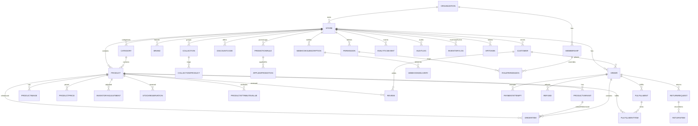

# StormCom Database Schema Analysis & Evolution Plan

## Current Strengths
- Comprehensive core commerce entities (Product, Variant, Category, Brand, Order, Customer).
- Audit and Inventory logs present early.
- Store-level subscription meta enabling platform monetization.
- Use of enums for key lifecycle states (ProductStatus, OrderStatus, PaymentStatus, SubscriptionStatus).

## Current Weaknesses / Gaps
| Area | Issue | Consequence |
|------|-------|-------------|
| Pricing | Single price fields; no multi-currency or tier | Limits internationalization & B2B volume pricing |
| Promotions | Absent discount/promotion modeling | No dynamic marketing levers |
| Fulfillment | No partial shipments or fulfillment entity | Can't track multi-package deliveries |
| Returns & Refunds | No structured return/refund tables | Manual reconciliation risk |
| Inventory | Product stock holds canonical qty + event logs conflated; no reservations | Oversell risk & difficult concurrency safety |
| Search | Images stored as JSON; no product images table; no embeddings | Hard to optimize queries & recommendations |
| RBAC | Enum-only roles; no permission granularity | Overbroad access / limited governance |
| Extensibility | No webhooks, plugin/app tables | Integrations blocked |
| Internationalization | No translation or currency rate tables | Single locale & currency constraint |
| Analytics | Missing events & aggregation tables | Hinders data-driven product iteration |

## Proposed Additions (New Tables)
| Table | Purpose |
|-------|---------|
| Collection / CollectionProduct | Curated product groupings & merchandising |
| ProductBundle / BundleItem | Bundled offers with aggregated inventory & pricing |
| ProductImage | Normalized images (ordering, alt text, SEO) |
| ProductPrice | Multi-currency; tier, segment-based pricing |
| ProductTranslation / CategoryTranslation / BrandTranslation | Locale-specific content |
| DiscountCode | Promotional codes with constraints |
| PromotionRule / AppliedPromotion | Complex conditional promotions |
| PaymentProviderConfig | Gateway credential abstraction |
| PaymentAttempt | Track retries & external references |
| Refund | Monetary adjustments post-payment |
| ReturnRequest / ReturnItem | RMA management |
| Fulfillment / FulfillmentItem | Shipment partition & tracking |
| ShippingProfile / ShippingRate | Configurable shipping logic |
| Shipment | Carrier label & tracking lifecycle |
| InventoryAdjustment | Event sourcing separation from Product stock snapshot |
| StockReservation | Temporary holds during checkout |
| CustomerSegment / CustomerSegmentMember | Targeted marketing |
| CustomerCustomField / CustomerCustomValue | Extended CRM data |
| AnalyticsEvent | Raw event ingestion |
| DailyStoreMetrics / CohortMetrics | Precomputed aggregate performance |
| OrderAttribution | Marketing channel attribution |
| Permission / RolePermission / ApiToken | Fine-grained RBAC + integration |
| WebhookSubscription / WebhookDelivery | Extensibility & external reactions |
| AppIntegration | Plugin marketplace foundation |
| JobDescriptor | Background job tracking |
| ProductEmbedding | Vector search & recommendations |
| DomainEvent | Immutable domain state transitions |
| CurrencyRate | FX conversions |
| Subscription (future separate from Store plan) | Recurring product/service billing |
| FraudAssessment | Fraud scoring metadata |

## Modeling Patterns
1. Event Sourcing (Incremental Adoption): Use `InventoryAdjustment` and (later) `DomainEvent` for high-value transitions (order status change, refund issued). Keep current state in aggregate tables (e.g., Product inventory fields) for read efficiency.
2. Soft Delete Uniformity: Ensure all soft-deletable tables share `deletedAt` and index partial queries: `CREATE INDEX ON products (store_id, status) WHERE deleted_at IS NULL`.
3. Correlation IDs: Add `correlationId` (UUID) and `requestId` to `AuditLog`, `PaymentAttempt`, `Fulfillment`, `Refund` for trace stitching.
4. JSON Normalization: Replace `images JSON` with normalized `ProductImage` for easier alt text additions and CDN transformations.
5. Multi-Currency & Segmented Pricing: `ProductPrice` keyed by `(productId|variantId, currency, segmentId?, minQty?)`.
6. Promotion Rule Engine: Condition JSON (e.g., `{ "minSubtotal": 100, "customerSegmentId": "..." }`) + Action JSON (`{ "discountPercent": 10 }`). Evaluate via deterministic interpreter service.
7. Index Strategy: Composite indexes including tenant key `storeId` first; partial indexes to reduce size and increase selectivity.

## Representative Prisma Model Drafts
```prisma
model ProductImage {
  id        String @id @default(cuid())
  productId String
  product   Product @relation(fields: [productId], references: [id], onDelete: Cascade)
  url       String
  alt       String?
  position  Int @default(0)
  createdAt DateTime @default(now())
  @@index([productId, position])
}

model ProductPrice {
  id          String @id @default(cuid())
  productId   String?
  variantId   String?
  currency    String @default("USD")
  segmentId   String? // customer segmentation
  minQty      Int @default(1)
  amount      Float
  compareAt   Float?
  effectiveAt DateTime @default(now())
  expiresAt   DateTime?
  createdAt   DateTime @default(now())
  @@index([productId, currency, segmentId])
  @@index([variantId, currency, segmentId])
}

model PaymentAttempt {
  id          String @id @default(cuid())
  orderId     String
  order       Order @relation(fields: [orderId], references: [id], onDelete: Cascade)
  gateway     PaymentGateway
  status      PaymentStatus @default(PENDING)
  amount      Float
  externalRef String? // Stripe payment intent id
  failureReason String?
  correlationId String? // request flow
  createdAt   DateTime @default(now())
  updatedAt   DateTime @updatedAt
  @@index([orderId, status])
}

model Refund {
  id        String @id @default(cuid())
  orderId   String
  order     Order @relation(fields: [orderId], references: [id], onDelete: Cascade)
  paymentAttemptId String?
  paymentAttempt   PaymentAttempt? @relation(fields: [paymentAttemptId], references: [id])
  amount    Float
  status    String @default("pending") // pending|processed|failed
  reason    String?
  createdAt DateTime @default(now())
  processedAt DateTime?
  @@index([orderId])
}

model Fulfillment {
  id        String @id @default(cuid())
  orderId   String
  order     Order @relation(fields: [orderId], references: [id], onDelete: Cascade)
  status    String @default("pending") // pending|packed|shipped|delivered|canceled
  trackingNumber String?
  carrier   String?
  trackingUrl String?
  shippedAt DateTime?
  deliveredAt DateTime?
  createdAt DateTime @default(now())
  updatedAt DateTime @updatedAt
  items     FulfillmentItem[]
  @@index([orderId, status])
}

model FulfillmentItem {
  id             String @id @default(cuid())
  fulfillmentId  String
  fulfillment    Fulfillment @relation(fields: [fulfillmentId], references: [id], onDelete: Cascade)
  orderItemId    String
  orderItem      OrderItem @relation(fields: [orderItemId], references: [id], onDelete: Cascade)
  quantity       Int
  @@unique([fulfillmentId, orderItemId])
}

model ReturnRequest {
  id        String @id @default(cuid())
  orderId   String
  order     Order @relation(fields: [orderId], references: [id], onDelete: Cascade)
  status    String @default("requested") // requested|approved|received|refunded|rejected
  reasonCode String?
  initiatedByCustomer Boolean @default(true)
  createdAt DateTime @default(now())
  updatedAt DateTime @updatedAt
  items     ReturnItem[]
  @@index([orderId, status])
}

model ReturnItem {
  id              String @id @default(cuid())
  returnRequestId String
  returnRequest   ReturnRequest @relation(fields: [returnRequestId], references: [id], onDelete: Cascade)
  orderItemId     String
  orderItem       OrderItem @relation(fields: [orderItemId], references: [id], onDelete: Cascade)
  quantity        Int
  condition       String @default("new") // new|opened|damaged
  @@unique([returnRequestId, orderItemId])
}

model InventoryAdjustment {
  id          String @id @default(cuid())
  storeId     String
  productId   String?
  variantId   String?
  delta       Int
  reasonCode  String // sale|return|manual|correction|initial
  note        String?
  correlationId String?
  userId      String?
  createdAt   DateTime @default(now())
  @@index([storeId, productId])
  @@index([storeId, variantId])
}

model StockReservation {
  id          String @id @default(cuid())
  storeId     String
  productId   String?
  variantId   String?
  quantity    Int
  expiresAt   DateTime
  orderId     String?
  createdAt   DateTime @default(now())
  @@index([storeId, productId])
  @@index([storeId, variantId])
  @@index([expiresAt])
}
```

## Index & Performance Strategy
- Always prefix composite indexes with `storeId` for tenant isolation & selectivity.
- Partial indexes excluding soft-deleted rows: `CREATE INDEX active_products_idx ON products (store_id, status) WHERE deleted_at IS NULL;`
- Covering indexes when pagination heavy: `(store_id, created_at DESC, id)` for orders.
- Consider table partitioning (Postgres) by month for `AuditLog` and `AnalyticsEvent` after exceeding ~50M rows.

## Mermaid ER Diagram (Core + Proposed Extensions)


## Migration Sequencing Strategy
1. Non-invasive tables (Collections, ProductImage, PaymentAttempt, Refund, Fulfillment, ReturnRequest) – additive.
2. Pricing restructure (`ProductPrice`) while retaining legacy price fields; dual-write then remove old fields.
3. Inventory event separation (introduce `InventoryAdjustment`) – backfill from existing `inventoryQty` delta calculations.
4. Promotion system (DiscountCode, PromotionRule, AppliedPromotion) – integrate into order pricing pipeline.
5. RBAC expansion – create permissions, map existing roles to permission sets.
6. Webhook & analytics events – start capturing without consumers, validate volume & reliability.
7. Internationalization tables – optional feature flags per store.

## Data Integrity & Constraints
- Enforce uniqueness constraints for slugs per tenant across new tables.
- Use cascading deletes carefully; prefer soft delete for merchant-managed content (products, collections) and hard delete for ephemeral logs (reservations after expiry).
- Guarantee `Refund.amount <= PaymentAttempt.amount` at application service layer.

## Observability & Auditing Enhancements
Add fields to `AuditLog`:
```prisma
model AuditLog {
  // existing fields...
  correlationId String?
  requestId String?
  actorType String @default("USER") // USER|SYSTEM|JOB
  severity  String @default("info") // info|warning|critical
  signature String? // HMAC for tamper detection
}
```
Signature workflow: `signature = HMAC(store.auditSecret, concat(entityType, entityId, action, createdAt))`.

## Risk Mitigation
| Risk | Mitigation |
|------|------------|
| Overselling | StockReservation + atomic decrement in transaction |
| Inconsistent pricing | ProductPrice dual-write transitional period |
| Promotions stacking errors | Deterministic evaluation order & isStackable flags |
| Migration rollback complexity | Feature flag gating of new tables; keep legacy flows until validated |
| Performance regression | Add indexes alongside migrations; run EXPLAIN benchmarks |

## Implementation KPIs
- Payment success/failure tracked by PaymentAttempt ratio.
- Inventory accuracy tracked by delta reconciliation between aggregate and adjustment events.
- Promotion redemption count vs usageLimit.
- Webhook delivery success rate & latency distribution.
- Query performance for product listing after introducing collections (95th percentile ≤ previous baseline).

## Conclusion
This evolution introduces modularity, scalability, and analytics readiness while preserving existing operational behaviors. A disciplined, phased migration (additive → dual-write → cutover) minimizes risk and ensures backward compatibility. Event and pricing models position StormCom for future international, multi-channel, and AI-driven recommendation features.
