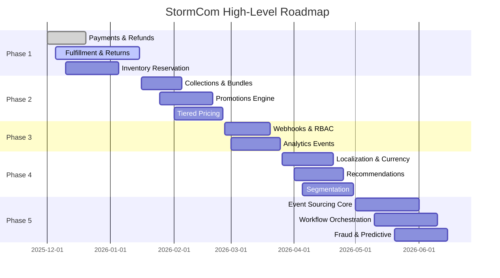

# StormCom Feature Roadmap & User Stories

## Roadmap Phases Overview
| Phase | Theme | Outcome |
|-------|-------|--------|
| 1 | Lifecycle Completeness | Reliable order + payment + fulfillment + refunds foundation |
| 2 | Merchandising & Pricing | Increased merchant AOV & conversion via bundles, collections, promotions |
| 3 | Extensibility & Observability | Integrations, analytics instrumentation, granular permissions |
| 4 | Intelligence & Internationalization | Personalized pricing, recommendations, multi-locale expansion |
| 5 | Advanced Reliability & Automation | Event sourcing, workflow orchestration, predictive metrics |

## Phase 1: Lifecycle Completeness
### Goals
- Ensure full order state transitions with accurate inventory and financial auditability.
- Introduce idempotency and rate limiting for critical endpoints.

### Epics & Stories
1. Payment Attempts & Refunds
   - As a merchant admin, I can view all payment attempts for an order including failures.
   - As a support agent, I can issue a partial refund specifying items or amount.
2. Fulfillment & Shipments
   - As a fulfillment clerk, I can create multiple fulfillments for a single order with selected items.
   - As a merchant, I can update tracking info and mark shipments delivered.
3. Returns Management
   - As a customer, I can initiate a return for eligible items.
   - As a merchant admin, I can approve or reject returns with a reason.
4. Inventory Reservations
   - As a system, when a checkout starts, inventory for items is reserved for a short period to prevent overselling.
5. Idempotent Order Creation
   - As an integration developer, my retry of the same order creation with the same key returns the original result.
6. Rate Limiting & Observability
   - As a platform operator, I see rate limit metrics per store & user.

### KPIs
- <1% oversell incidents.
- 100% payment attempts logged.
- P95 order creation latency < 400ms.

## Phase 2: Merchandising & Pricing
### Goals
- Enhance product discovery and conversion via curated grouping and dynamic pricing.

### Epics & Stories
1. Collections
   - As a merchant, I can create collections and manually order products.
   - As a customer, I can browse featured collections.
2. Bundles
   - As a merchant, I can offer product bundles at a discounted composite price.
   - As a customer, I see bundle savings clearly displayed.
3. Discount Codes & Promotions
   - As a merchant, I can configure discount codes with limits and expiration.
   - As a merchant, I can create conditional promotions (e.g., spend > $100 get 10% off).
4. Tiered & Segment Pricing
   - As a merchant, I can define volume pricing (buy 10+ at $5.00). 
   - As a merchant, I can target a segment (VIP) with special pricing.
5. Featured & Recommended Products UI
   - As a customer, I see recommended products based on current item context.

### KPIs
- +10% AOV.
- >20% of orders use at least one promotion.

## Phase 3: Extensibility & Observability
### Goals
- Open ecosystem, improve insight & permission governance.

### Epics & Stories
1. Webhooks
   - As a developer, I can subscribe to order.created and product.updated events.
   - As a merchant, I can view webhook delivery logs and retry failures.
2. Analytics Events
   - As a merchant, I view daily sales, top products, and cohort retention metrics.
3. Role-Based Permissions
   - As an admin, I assign granular permissions to staff roles (e.g. product.write, refund.issue).
4. API Tokens
   - As a developer, I create API tokens restricted to read-only catalog.
5. Audit Enhancements
   - As a compliance officer, I verify signed audit entries for product edits.

### KPIs
- <2% webhook delivery failure after retries.
- 100% critical actions captured with correlation IDs.

## Phase 4: Intelligence & Internationalization
### Goals
- Expand global reach, personalize shopping experience, improve discovery.

### Epics & Stories
1. Product Translations & Multi-Currency
   - As a merchant, I localize product names and descriptions per locale.
   - As a customer, I view prices converted in my preferred currency.
2. Customer Segmentation
   - As a merchant, I define dynamic segments (high LTV, churn risk) for targeted promotions.
3. Recommendations
   - As a customer, I get related product suggestions using vector similarity.
4. Currency Rate Sync
   - As a system, I update rates daily and recalculate display prices.
5. Marketing Automation
   - As a merchant, I configure an abandoned cart email flow.

### KPIs
- +5% conversion in localized markets.
- +8% repeat purchase rate with segmentation.

## Phase 5: Advanced Reliability & Automation
### Goals
- Increase robustness, reduce manual intervention, enable predictive insights.

### Epics & Stories
1. Event Sourcing Core Entities
   - As a developer, I can replay inventory adjustments to rebuild stock state.
2. Workflow Orchestration (Returns, Subscription Renewals)
   - As a system, I auto-progress return workflow states based on events.
3. Fraud Assessment
   - As a merchant, I see fraud scores and flagged orders requiring review.
4. Predictive Metrics (Churn, CLV)
   - As a merchant, I prioritize campaigns using predicted high-LTV customers.
5. Plugin Marketplace Foundation
   - As a merchant, I install third-party apps enhancing my store.

### KPIs
- <0.5% data inconsistency in inventory reconciliation.
- Automated handling of >70% returns without manual intervention.

## Dependencies & Sequencing Highlights
| Dependency | Blocks |
|------------|--------|
| PaymentAttempt table | Refund feature |
| Fulfillment tables | Shipment tracking UI |
| WebhookSubscription | External integration releases |
| ProductPrice | Multi-currency & segmentation pricing |
| DomainEvent | Event sourcing & replay tooling |
| ProductEmbedding | Recommendation engine |

## User Role Mapping & Stories
| Role | Key Stories |
|------|------------|
| Store Owner | Configure pricing tiers, view analytics dashboards, manage staff permissions |
| Admin | Create collections, manage promotions, approve returns, process refunds |
| Fulfillment Clerk | Create fulfillments, update shipment tracking |
| Support Agent | Initiate refunds, review return requests |
| Marketing Manager | Launch email campaigns, define segments |
| Developer (Integration) | Subscribe to webhooks, query public REST API |
| Customer | Browse localized products, initiate returns, use discount codes |

## Example Detailed User Story (Refund Issuance)
"As a support agent (role: ADMIN with refund.issue permission), when viewing a paid order, I can select items and amounts for partial refund. The system displays the remaining refundable balance. On confirmation, a Refund record (status=pending) is created, Stripe API is invoked with an idempotency key, and the UI shows a pending status which transitions to processed asynchronously."

## Acceptance Criteria Example (Inventory Reservation)
- Reservation created when checkout begins with expiry 15 minutes.
- Reservation decreased when order successfully paid.
- Reservation released automatically after expiry or cancellation.
- Overselling test: Simulate 50 concurrent checkouts; final inventory count matches expected decrements with no negatives.

## Non-Functional Requirements by Phase
| NFR | Target |
|-----|--------|
| Availability | 99.5% by Phase 3, 99.9% by Phase 5 |
| Latency (P95 product list) | < 250ms Phase 2 |
| Latency (P95 order creation) | < 400ms Phase 1 and remain stable |
| Scalability (tenants) | 1K Phase 3, 10K Phase 5 row-level tenancy |
| Security | OWASP Top 10 mitigations Phase 2, encrypt PII Phase 4 |

## Metrics Instrumentation Plan
| Metric | Source | Tool |
|--------|--------|------|
| Order creation latency | API middleware | OpenTelemetry + Prometheus |
| Webhook delivery success | WebhookDelivery table | Aggregation job |
| Promotion redemption | AppliedPromotion table | DailyStoreMetrics aggregation |
| Refund processing time | Refund table | SLA alerts |
| Inventory reconciliation drift | Product vs sum(Adjustments) | Nightly job report |

## Risks & Mitigation
| Risk | Phase | Mitigation |
|------|-------|-----------|
| Schema explosion complexity | 2-4 | Modular migrations, feature flags |
| Performance regression after added joins | 2 | Index reviews, query caching (cache tags) |
| Over-engineering event sourcing prematurely | 5 | Limit early scope to inventory adjustments first |
| Multi-currency rounding errors | 4 | Use decimal (numeric) precision with fixed scale |

## Roadmap Visualization (Mermaid)

## Conclusion
This roadmap operationalizes the earlier analyses into actionable phases with clear user value and internal architecture maturation. Progressive layering minimizes refactor churn while building a competitive, extensible commerce SaaS platform.

---
## 2025-11-24 Cross-Reference & KPI Enhancement Addendum
Roadmap phases are revalidated against funnel stages and MACH alignment to ensure each increment directly contributes to measurable merchant value.

### A. Funnel Overlay on Phases
| Phase | Primary Funnel Focus | Key KPI |
|-------|----------------------|---------|
| 1 | Conversion (checkout integrity) | Order creation p95 latency |
| 2 | Consideration / Conversion | AOV uplift, promotion adoption |
| 3 | Measurement / Conversion | Webhook success %, analytics freshness |
| 4 | Loyalty / Conversion | Repeat purchase uplift, recovery rate |
| 5 | Measurement / Loyalty | Data consistency incidents, automated workflow coverage |

### B. MACH Principle Reinforcement per Phase
| Phase | MACH Boost |
|-------|-----------|
| 1 | API-first: add idempotent order endpoint spec |
| 2 | Headless: GraphQL schema extension for collections & bundles |
| 3 | Cloud-native: event emission + lightweight queue adoption |
| 4 | Microservices ready: segmentation & pricing services separated logically |
| 5 | Resilience: event sourcing pilot enabling future service extraction |

### C. Expanded KPI Targets
| KPI | Phase Introduced | Target |
|-----|------------------|-------|
| Cache Hit Ratio (product/category) | 1 | >65% |
| Promotion Adoption Rate | 2 | >20% of orders |
| Webhook Delivery Success | 3 | >98% after retries |
| Abandoned Cart Recovery Rate | 4 | >12% |
| Automated Returns Workflow Coverage | 5 | >70% |

### D. Risk Tracking Enhancements
| Risk | Phase | Tracking Mechanism |
|------|-------|-------------------|
| Inventory oversell | 1 | Reconciliation nightly job |
| Promotion miscalc | 2 | Validation & rule evaluation span metrics |
| Webhook storm | 3 | Queue depth & failure rate alert |
| Segment proliferation | 4 | Segment count quota + growth alert |
| Event sourcing drift | 5 | Projection verification script |

### E. Immediate Backlog Reprioritization Snapshot
| Item | Original Phase | Adjusted Priority Reason |
|------|---------------|--------------------------|
| Cache tag invalidation | 2 | Moves to Phase 1 for early perf & cost impact |
| ProductSummary read model | 2 | Moves to Phase 1 for performance baseline |
| Correlation ID logging | 3 | Moves to Phase 1 for observability foundation |

### F. Alignment Statement
Phase execution sequencing now optimizes early performance (cache & read model) and observability before higher-complexity commercial features, reducing regression risk and clarifying ROI measurement from the outset.

*Addendum authored 2025-11-24; integrate KPI changes into dashboard planning.*
