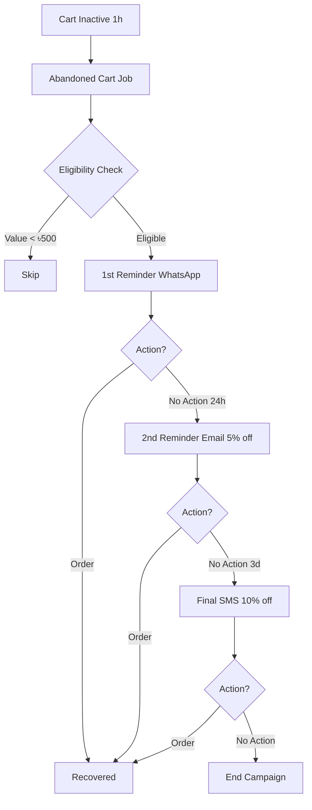
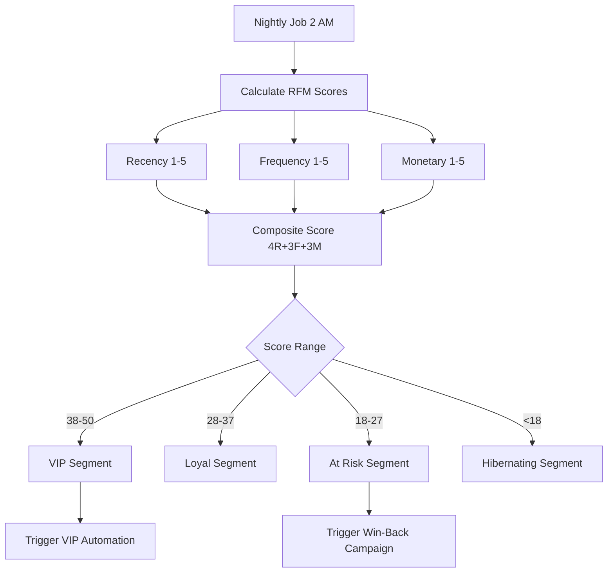
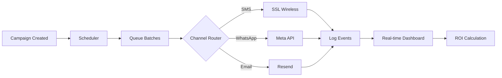

# StormCom Marketing Automation & Segmentation Strategy

## 1. Objectives
| Objective | Outcome |
|-----------|--------|
| Reduce Abandoned Carts | Recover revenue via targeted reminder flows |
| Increase Repeat Purchases | Personalized offers based on RFM & lifecycle stage |
| Improve Promotion ROI | Target segments most responsive to discount type |
| Build Customer Intelligence | Data foundation for predictive CLV & churn risk |
| Enable Merchants Self-Serve | UI to configure campaigns & review performance |

## 2. Core Models & Data Flows
| Model | Purpose |
|-------|--------|
| Cart / CartItem | Track in-progress purchase intent |
| CustomerRFMSnapshot | Periodic scoring snapshot (Recency, Frequency, Monetary) |
| CustomerSegment | Persistent segment definition (criteria JSON) |
| CustomerSegmentMember | Mapping of customers to segments |
| CustomerLifecycleMetrics | Stage tracking & churn risk score |
| EmailCampaign | Campaign metadata & targeting configuration |
| EmailEvent | Engagement logging (SENT, OPEN, CLICK, BOUNCE) |
| RecommendationEvent | Generated upsell/cross-sell suggestions |
| AppliedPromotion | Reflects promotions used; feed ROI analysis |

## 3. RFM Scoring
- Recency: Days since last completed order.
- Frequency: Orders in last N days (e.g., 180).
- Monetary: Total spend in rolling window.
- Score bucket mapping (1–5) per dimension; composite = weighted sum (e.g., 4R + 3F + 3M).
- Snapshot Job: Nightly compute → insert `CustomerRFMSnapshot` → update segment membership.

## 4. Segment Definition Examples
| Segment | Criteria JSON (Conceptual) |
|---------|----------------------------|
| VIP | `{"rfm.composite": {"gte": 38}}` |
| Churn Risk | `{"lifecycle.stage": "ACTIVE", "daysSinceLastOrder": {"gte": 45}}` |
| New Customers | `{"orders.count": {"lte": 1}, "daysSinceFirstOrder": {"lte": 14}}` |
| High Discount Sensitivity | `{"promotions.redeemedRatio": {"gte": 0.5}}` |
| Cross-Sell Opportunity | `{"categories.lastOrderMissing": ["Accessories"]}` |

## 5. Automation Triggers
| Trigger | Condition | Action |
|---------|----------|--------|
| Abandoned Cart | `cart.updatedAt` inactivity > 1h & not converted | Send cart reminder email w/ dynamic product list |
| Churn Risk | Lifecycle stage ACTIVE + last order > 45d | Send win-back offer (e.g., discount code) |
| VIP Milestone | Composite RFM crosses threshold | Send loyalty reward / early access promotion |
| Post-Purchase | Order status PAID | Send upsell recommendations after 2d |
| Segment Entry | Customer added to segment | Fire onboarding sequence |

## 6. Campaign Execution Flow
1. Trigger detection writes queued automation task (idempotent key = customerId + triggerType + date bucket).
2. Worker resolves segment & personalization data (recommended products, discount code if applicable).
3. Email content templated (liquid / handlebars) + variable substitution.
4. Dispatch via Resend (or provider) with metadata (campaignId, correlationId).
5. EmailEvent entries recorded asynchronously on feedback (open, click, bounce) via webhook ingestion.

## 7. Idempotency & Rate Limits
| Aspect | Rule |
|--------|------|
| Same Trigger & Customer | Max 1 execution per 24h |
| Campaign Flood Control | Max X emails/customer/day (configurable) |
| High-Value Offer | Cooldown (e.g., 14d) before re-offering similar incentive |
| Abandoned Cart | Stop sending once order created or cart cleared |

## 8. Metrics & KPIs
| KPI | Description | Source |
|-----|-------------|--------|
| Cart Recovery Rate | Recovered carts / total abandoned | Cart + Order linkage |
| Churn Win-back Rate | % churn-risk recipients who order within 14d | Lifecycle metrics + orders |
| Segment Conversion Uplift | Delta conversion vs baseline | Segment membership & order data |
| Campaign Open Rate | OPEN / SENT | EmailEvent |
| Campaign Click Rate | CLICK / SENT | EmailEvent |
| Promotion Attribution | Order revenue influenced by campaign promos | AppliedPromotion + campaign mapping |

## 9. UI Components
| Component | Function |
|-----------|----------|
| SegmentBuilder | Visual criteria editor (chips, dropdowns) |
| CampaignWizard | Multi-step setup (trigger, template, audience) |
| EmailTemplatePreview | Render personalization variables & test data |
| PerformanceDashboard | Charts: recovery %, open/click rates, RFM distribution |
| AutomationLogViewer | List of recent trigger executions & statuses |

## 10. Data Quality & Governance
- Snapshot Integrity: Validate RFM snapshot count equals active customer count.
- Segment Drift: Alert if segment population changes > X% daily (unexpected).
- Campaign Effectiveness: A/B framework placeholder (store variant groups for template comparison).
- Privacy: Honor opt-out flags; filter segmentation query builder to exclude unsubscribed customers.

## 11. Recommendation Strategy (Early)
- Rule-based (same category, top-selling complimentary). Later: embedding similarity.
- Cache suggestions per product context; expire daily.
- Avoid duplicates with items already in cart or purchased in last N days.

## 12. Event Taxonomy (DomainEvent)
| Event | Purpose |
|-------|--------|
| order.created | Post-purchase automation trigger |
| cart.updated | Abandoned cart inactivity tracking |
| customer.segmented | Segment entry/exit notifications |
| promotion.redeemed | Promotion performance metrics |
| email.sent / email.open / email.click | Engagement metrics feeding lifecycle stage |

## 13. Roadmap Phases
| Phase | Focus |
|-------|-------|
| A | RFM Snapshot + SegmentBuilder + Cart model |
| B | Abandoned Cart + Churn Risk triggers |
| C | RecommendationEvent + Post-purchase upsell |
| D | A/B testing scaffolding + advanced lifecycle metrics |
| E | Predictive churn & CLV model integration |

## 14. Risks & Mitigations
| Risk | Mitigation |
|------|-----------|
| Over-email fatigue | Rate limits + preference center |
| Segment explosion (too many) | Segment creation quotas + review UI |
| Personalization data stale | Daily refresh job + cache TTL | 
| Performance degradation from segment queries | Precomputed membership table + indexed criteria fields |

## 15. Success Metrics (Initial Targets)
| Metric | Target |
|--------|--------|
| Abandoned Cart Recovery | > 12% recovered |
| Churn Win-back | > 8% reactivated |
| VIP Segment Accuracy | <1% misclassification audits |
| Average Campaign Open Rate | > 30% |
| Average Campaign Click Rate | > 6% |

---
*Marketing automation foundation prioritizes reliable data collection (RFM, segments) before complex predictive modeling.*

---
## 2025-11-24 Cross-Reference & Optimization Addendum
Aligns marketing automation roadmap with funnel stages, MACH strategy, and cost safeguards.

### A. Funnel Mapping
| Automation Feature | Funnel Stage | KPI |
|--------------------|-------------|-----|
| Abandoned Cart Recovery | Conversion | Recovery rate |
| Churn Risk Win-back | Loyalty | Reactivation % |
| RFM Segmentation | Loyalty | Repeat purchase rate |
| Post-Purchase Upsell | Consideration / Loyalty | Upsell conversion |
| VIP Milestone Rewards | Loyalty | VIP retention rate |

### B. MACH Alignment
| Aspect | Alignment |
|--------|----------|
| API-first | Campaign CRUD & segment endpoints support external orchestration |
| Headless | Recommendation API consumed by multiple frontends |
| Cloud-native | Batch jobs scheduled; heavy tasks offloaded |
| Microservices-ready | Segmentation & recommendation logic separable later |

### C. Cost & Rate Control Enhancements
| Control | Purpose |
|---------|--------|
| Email frequency cap per customer | Prevent fatigue & cost waste |
| Trigger idempotency keys | Avoid duplicate sends on race conditions |
| Priority queue (high-value carts first) | Optimize ROI on limited send budget |
| Segment differential computation | Reduce full snapshot cost |

### D. Data Quality Guardrails
| Guardrail | Description |
|----------|-------------|
| RFM snapshot completeness check | Ensure all active customers scored |
| Segment drift alert | Population swings > X% flagged |
| Template variable validation | Catch missing placeholders pre-send |

### E. Success Metrics Extension
| Metric | Target |
|--------|-------|
| Time to configure new campaign | < 5 minutes |
| Email open rate (avg) | > 30% |
| Email click rate (avg) | > 6% |
| Segment evaluation latency (batch) | < 10m for 100K customers |

### F. Immediate Implementation Actions
1. Introduce Cart & CartItem models.
2. Build RFM snapshot job & segment diff engine.
3. Implement abandoned cart trigger with suppression logic.
4. Add EmailEvent ingestion & analytics dashboard baseline.
5. Ship recommendation rule-based engine (embeddings later).

### G. Alignment Statement
Marketing automation is staged to deliver measurable conversion & retention uplift with guarded cost exposure and robust data integrity checks before scaling to predictive models.

*Addendum authored 2025-11-24.*

---
## 2025-11-24 MARKETING_AUTOMATION_V2 Integration Analysis

### H. V2 Feature Comparison & Implementation Roadmap

#### H.1 Feature Coverage Analysis

| MARKETING_AUTOMATION_V2 Feature | Original Doc Coverage | V2 Enhancements | Priority | Effort |
|--------------------------------|---------------------|----------------|----------|--------|
| **Campaign Management** | ❌ Not covered | ✅ Full campaign builder, templates, multi-channel | P1 | L |
| **Customer Segmentation** | ✅ Covered (SegmentBuilder) | ✅ Enhanced with RFM integration | P1 | M |
| **RFM Analysis** | ✅ Covered (basic scoring) | ✅ Detailed scoring buckets (1-5) + composite | P1 | M |
| **Abandoned Cart Recovery** | ✅ Covered (trigger only) | ✅ Complete 3-step workflow with delays | P1 | M |
| **Multi-Channel Marketing** | ❌ Not covered | ✅ SMS/WhatsApp/Email/Push with cost analysis | P1 | L |
| **Email Tracking** | ✅ Covered (EmailEvent) | ✅ Enhanced with open/click/bounce tracking | P1 | S |
| **Marketing Automation** | ✅ Covered (AutomationWorkflow) | ✅ 7 automation types with templates | P2 | M |
| **SMS Gateway Integration** | ❌ Not covered | ✅ SSL Wireless/Banglalink/Robi integration | P1 | M |
| **WhatsApp Integration** | ❌ Not covered | ✅ Meta Business API with template approval | P2 | M |
| **Campaign Analytics** | ✅ Covered (basic KPIs) | ✅ Real-time dashboard, ROI tracking, attribution | P1 | M |
| **Bangladesh Payment (bKash)** | ❌ Not covered | ✅ SMS credit purchase workflow | P2 | S |
| **Recommendation Engine** | ✅ Covered (RecommendationEvent) | ✅ Rule-based + embedding-based strategies | P3 | L |
| **Lifecycle Metrics** | ✅ Covered (CustomerLifecycleMetrics) | ✅ Enhanced with churn risk scoring | P2 | M |
| **A/B Testing** | ❌ Not covered | ✅ Campaign variant testing framework | P3 | M |
| **Delivery Partner Integration** | ❌ Not covered | ✅ Pathao/Steadfast/RedX tracking APIs | P3 | S |
| **Bangladesh Seasonal Templates** | ❌ Not covered | ✅ Eid, Pohela Boishakh, Victory Day templates | P1 | S |

**Legend:**
- Priority: P1 (Critical - Month 1-2), P2 (High - Month 3-4), P3 (Medium - Month 5-6)
- Effort: S (Small <3 days), M (Medium 3-7 days), L (Large >7 days)

#### H.2 Enhanced Schema Requirements

**New Tables Required (Beyond Original Document):**

```prisma
// SMS Integration (V2 Addition)
model SmsProvider {
  id String @id @default(cuid())
  storeId String @unique
  provider String // SSL_WIRELESS, BANGLALINK, ROBI
  apiKey String
  apiSecret String
  senderId String
  creditBalance Int @default(0)
  ratePerSms Float @default(1.0) // BDT per SMS
  isActive Boolean @default(true)
  logs SmsLog[]
  createdAt DateTime @default(now())
  updatedAt DateTime @updatedAt
}

model SmsLog {
  id String @id @default(cuid())
  providerId String
  provider SmsProvider @relation(fields: [providerId], references: [id])
  campaignId String?
  campaign EmailCampaign? @relation(fields: [campaignId], references: [id])
  customerId String?
  phoneNumber String
  message String
  status SmsStatus // QUEUED, SENT, DELIVERED, FAILED
  cost Float
  externalId String? // Provider message ID
  errorCode String?
  sentAt DateTime?
  deliveredAt DateTime?
  createdAt DateTime @default(now())
  
  @@index([providerId, status])
  @@index([campaignId])
}

// WhatsApp Integration (V2 Addition)
model WhatsAppTemplate {
  id String @id @default(cuid())
  storeId String
  store Store @relation(fields: [storeId], references: [id])
  name String
  category String // MARKETING, TRANSACTIONAL
  language String @default("en")
  content String // Template body with placeholders
  headerType String? // TEXT, IMAGE, VIDEO
  headerContent String?
  buttons String? // JSON array of buttons
  status WhatsAppTemplateStatus // PENDING, APPROVED, REJECTED
  metaTemplateId String? // Meta's template ID
  rejectionReason String?
  createdAt DateTime @default(now())
  updatedAt DateTime @updatedAt
  
  @@unique([storeId, name])
}

model WhatsAppMessage {
  id String @id @default(cuid())
  campaignId String?
  campaign EmailCampaign? @relation(fields: [campaignId], references: [id])
  customerId String
  templateId String
  template WhatsAppTemplate @relation(fields: [templateId], references: [id])
  phoneNumber String
  variables String? // JSON object for template placeholders
  status WhatsAppMessageStatus // QUEUED, SENT, DELIVERED, READ, FAILED
  externalId String? // Meta's message ID
  cost Float @default(0.50) // BDT per WhatsApp message
  errorCode String?
  sentAt DateTime?
  deliveredAt DateTime?
  readAt DateTime?
  createdAt DateTime @default(now())
  
  @@index([campaignId])
  @@index([customerId])
}

// Campaign Templates (V2 Addition)
model CampaignTemplate {
  id String @id @default(cuid())
  storeId String?
  store Store? @relation(fields: [storeId], references: [id])
  name String
  type CampaignType
  category String // SEASONAL, PROMOTIONAL, AUTOMATION
  description String?
  thumbnailUrl String?
  defaultContent String // JSON: channel-specific content
  isSystem Boolean @default(false) // System templates vs custom
  usageCount Int @default(0)
  createdAt DateTime @default(now())
  updatedAt DateTime @updatedAt
  
  @@index([storeId, category])
  @@index([type, isSystem])
}

// Enhanced Cart Models
model CartAbandonmentEvent {
  id String @id @default(cuid())
  cartId String
  cart Cart @relation(fields: [cartId], references: [id])
  customerId String?
  abandonedAt DateTime @default(now())
  recoveryAttempts Int @default(0)
  lastReminderSentAt DateTime?
  recoveredAt DateTime?
  orderId String? // If cart converted to order
  
  @@index([cartId])
  @@index([recoveredAt])
}

enum SmsStatus { QUEUED, SENT, DELIVERED, FAILED, REJECTED }
enum WhatsAppTemplateStatus { PENDING, APPROVED, REJECTED }
enum WhatsAppMessageStatus { QUEUED, SENT, DELIVERED, READ, FAILED }
```

#### H.3 Bangladesh Market Cost Optimization

| Optimization Strategy | Cost Saving | Implementation |
|----------------------|-------------|----------------|
| **Bengali Character Optimization** | 50% reduction in SMS segments | Trim to 70 chars for Bengali (UTF-16) |
| **WhatsApp Priority Routing** | 50% cheaper than SMS | Route to WhatsApp first, fallback to SMS |
| **Email for Detailed Content** | 90% cheaper than SMS | Use email for newsletters, SMS for urgent |
| **Smart Retry Logic** | Avoid duplicate sends | Idempotency keys with 24h cooldown |
| **Segment Targeting** | Send only to relevant customers | RFM-based filtering reduces waste |
| **Off-Peak Scheduling** | Provider discounts (5-10%) | Schedule non-urgent campaigns at night |
| **Bulk SMS Packages** | 20% discount on 10,000+ SMS | Purchase in bulk: ৳8,000 for 12,000 SMS |
| **Free Channels First** | Zero cost for push notifications | Use push for app users before paid channels |

**ROI Optimization Formula:**
```
Expected ROI = (Avg Order Value × Conversion Rate × Reach) / Total Campaign Cost
Minimum ROI Threshold = 10:1 (for every ৳1 spent, earn ৳10+)
```

**Example Calculation (5,000 customer Eid campaign):**
```
Channel: SMS (৳1 each)
Reach: 5,000 customers
Total Cost: ৳5,000
Conversion Rate: 3.8% (190 orders)
Avg Order Value: ৳2,500
Revenue: ৳4,75,000
ROI: 95:1 ✅ (exceeds 10:1 threshold)
```

#### H.4 Process Flow Diagrams

**Abandoned Cart Recovery Workflow:**


**RFM Segmentation Workflow:**


**Campaign Execution Pipeline:**


#### H.5 Implementation Checklist

**Phase 1: Foundation (Weeks 1-4)**
- [ ] Add Cart, CartItem, CartAbandonmentEvent models
- [ ] Implement EmailCampaign & EmailEvent models
- [ ] Integrate Resend for email sending
- [ ] Build basic campaign builder UI
- [ ] Implement cart abandonment detection job (15-minute cron)
- [ ] Create first automation: 1-hour WhatsApp reminder
- [ ] Add EmailEvent webhook ingestion endpoint

**Phase 2: Multi-Channel (Weeks 5-8)**
- [ ] Add SmsProvider & SmsLog models
- [ ] Integrate SSL Wireless SMS gateway
- [ ] Add WhatsAppTemplate & WhatsAppMessage models
- [ ] Integrate Meta Business API (requires approval)
- [ ] Build channel selection UI in campaign builder
- [ ] Implement cost calculator (preview before send)
- [ ] Add frequency cap logic (max 2 campaigns/customer/day)

**Phase 3: Segmentation (Weeks 9-12)**
- [ ] Add CustomerRFMSnapshot model
- [ ] Implement nightly RFM calculation job
- [ ] Build segment builder UI (criteria editor)
- [ ] Add CustomerSegment & CustomerSegmentMember models
- [ ] Implement dynamic segment refresh (daily)
- [ ] Add segment analytics dashboard
- [ ] Create pre-built segments (VIP, New, At Risk, Hibernating)

**Phase 4: Advanced Automation (Weeks 13-16)**
- [ ] Add AutomationWorkflow & AutomationExecution models
- [ ] Implement welcome series automation (3 emails, 7 days)
- [ ] Add win-back campaign (churn risk customers)
- [ ] Implement post-purchase upsell automation
- [ ] Add birthday/anniversary automation
- [ ] Build automation performance dashboard
- [ ] Implement A/B testing framework for campaigns

**Phase 5: Analytics & Optimization (Weeks 17-20)**
- [ ] Build real-time campaign analytics dashboard
- [ ] Implement revenue attribution tracking
- [ ] Add customer lifetime value (CLV) prediction
- [ ] Build RFM segment movement visualization
- [ ] Add campaign ROI comparison charts
- [ ] Implement cost optimization recommendations
- [ ] Add Bangladesh seasonal template library

#### H.6 Success Metrics Alignment

| Metric | Original Target | V2 Target | Measurement Method |
|--------|----------------|-----------|-------------------|
| **Cart Recovery Rate** | >12% | 25-30% | (Recovered carts / Total abandoned) × 100 |
| **Email Open Rate** | >30% | 35% | EmailEvent OPENED / SENT |
| **SMS Delivery Rate** | - | 98% | SmsLog DELIVERED / SENT |
| **WhatsApp Read Rate** | - | 70% | WhatsAppMessage READ / SENT |
| **Campaign ROI** | - | 50:1 minimum | Revenue generated / Cost spent |
| **Segment Accuracy** | <1% misclassification | 95%+ accuracy | Manual audit of random sample |
| **Automation Success Rate** | - | 99% | Completed / Total executions |
| **Setup Time** | - | <5 minutes | User testing average |

#### H.7 Bangladesh Cultural Calendar Integration

**Pre-built Campaign Templates:**

| Event | Date Range | Template Type | Recommended Discount | Channel Mix |
|-------|-----------|---------------|---------------------|-------------|
| **Eid-ul-Fitr** | April (lunar) | SEASONAL | 30-50% | SMS + WhatsApp + Email |
| **Pohela Boishakh** | April 14-15 | SEASONAL | 25-40% | Email + Social Media |
| **Eid-ul-Adha** | June (lunar) | SEASONAL | 30-50% | SMS + WhatsApp + Email |
| **Victory Day** | December 16 | SEASONAL | 16% (symbolic) | SMS + Email |
| **Independence Day** | March 26 | SEASONAL | 26% (symbolic) | SMS + Email |
| **Ramadan Nights** | March-April (lunar) | SEASONAL | 20-35% | WhatsApp + Email |
| **Durga Puja** | October (lunar) | SEASONAL | 25-40% | Email + Social Media |
| **Flash Sales** | Weekly (Friday) | PROMOTIONAL | 50-70% | SMS (urgent) |

**Timing Recommendations:**
- **Best Send Times**: 10 AM, 2 PM, 8 PM (Bangladesh Standard Time)
- **Avoid**: 1-2 PM (lunch), 1-7 AM (sleep), Friday prayer time (1-2 PM)
- **Peak Days**: Thursday evening (pre-weekend), Saturday morning
- **Low Response**: Sunday evening, Monday morning

#### H.8 Cost-Effective Deployment

| Resource | Recommendation | Estimated Monthly Cost | Cost Benefit |
|----------|---------------|----------------------|--------------|
| **Email Service** | Resend (50,000 free, then $20/mo) | $0-20 | Free tier covers initial scale |
| **SMS Gateway** | SSL Wireless (pay-as-you-go) | ৳10,000-50,000 | No fixed fees, bulk discounts |
| **WhatsApp API** | Twilio/MessageBird | ৳5,000-25,000 | Cheaper than SMS, richer content |
| **Background Jobs** | Vercel Cron (free for daily/hourly) | $0 | Built-in Next.js feature |
| **Queue System** | Upstash Redis (10,000 free commands/day) | $0-10 | Serverless, pay-per-use |
| **Analytics Storage** | Postgres (Neon serverless) | $0-25 | Autoscaling, no fixed cost |
| **Image Storage** | Cloudflare R2 (10GB free/mo) | $0-5 | Cheaper than S3 |

**Total Monthly Infrastructure Cost**: $30-85 (~৳3,500-10,000)
**Expected Monthly Revenue Impact**: ৳500,000-2,000,000 (5,000 customers, 4 campaigns)
**ROI on Infrastructure**: 5,000-66,000%

#### H.9 Risk Mitigation

| Risk | Probability | Impact | Mitigation Strategy |
|------|------------|--------|---------------------|
| **SMS Gateway Downtime** | Medium | High | Multi-provider failover (SSL → Banglalink) |
| **WhatsApp Template Rejection** | High | Medium | Pre-approval process, template library |
| **Email Spam Flagging** | Medium | High | Domain authentication (SPF/DKIM), warm-up |
| **Over-emailing Fatigue** | High | High | Frequency caps, unsubscribe link, preference center |
| **Cart Detection Delays** | Low | Medium | 15-minute job frequency, race condition handling |
| **RFM Calculation Errors** | Low | Medium | Snapshot completeness check, alert on drift |
| **Cost Overruns** | Medium | High | Budget alerts, pre-campaign cost preview |
| **BTRC Compliance Issues** | Low | Critical | Sender ID registration, DND registry check |

### I. Immediate Action Items

**Critical (Start This Week):**
1. Create Cart & CartItem schema migration
2. Set up Resend email service account
3. Research SSL Wireless SMS gateway pricing & registration
4. Design campaign builder wireframes
5. Implement basic cart tracking (ACTIVE → ABANDONED logic)

**High Priority (Next 2 Weeks):**
1. Build EmailCampaign CRUD API endpoints
2. Implement EmailEvent webhook ingestion
3. Create abandoned cart detection cron job
4. Design RFM calculation algorithm
5. Build campaign analytics schema

**Medium Priority (Month 2):**
1. Integrate SMS gateway API
2. Build segmentation UI
3. Implement first automation workflow
4. Create Bangladesh seasonal templates
5. Add multi-channel routing logic

*MARKETING_AUTOMATION_V2 integration analysis completed 2025-11-24.*